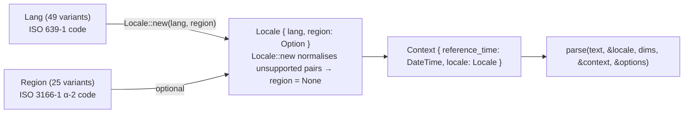

# Locale System

Source: `/Users/cpb/projects/duks/wafer-inc-duckling/src/locale.rs`
Context/Options: `/Users/cpb/projects/duks/wafer-inc-duckling/src/resolve.rs`

---

## Architecture overview



---

## `Lang` — 49 variants

```rust
#[derive(Debug, Clone, Copy, PartialEq, Eq, Hash)]
pub enum Lang {
    AF, AR, BG, BN, CA, CS, DA, DE, EL, EN, ES, ET, FA, FI, FR,
    GA, HE, HI, HR, HU, ID, IS, IT, JA, KA, KM, KN, KO, LO, ML,
    MN, MY, NB, NE, NL, PL, PT, RO, RU, SK, SV, SW, TA, TE, TH,
    TR, UK, VI, ZH,
}
```

Each variant has a corresponding ISO 639-1 code via `Lang::code() -> &'static str`.

Full mapping:

| Variant | Code | Language |
|---------|------|---------|
| `AF` | `af` | Afrikaans |
| `AR` | `ar` | Arabic |
| `BG` | `bg` | Bulgarian |
| `BN` | `bn` | Bengali |
| `CA` | `ca` | Catalan |
| `CS` | `cs` | Czech |
| `DA` | `da` | Danish |
| `DE` | `de` | German |
| `EL` | `el` | Greek |
| `EN` | `en` | English |
| `ES` | `es` | Spanish |
| `ET` | `et` | Estonian |
| `FA` | `fa` | Persian |
| `FI` | `fi` | Finnish |
| `FR` | `fr` | French |
| `GA` | `ga` | Irish |
| `HE` | `he` | Hebrew |
| `HI` | `hi` | Hindi |
| `HR` | `hr` | Croatian |
| `HU` | `hu` | Hungarian |
| `ID` | `id` | Indonesian |
| `IS` | `is` | Icelandic |
| `IT` | `it` | Italian |
| `JA` | `ja` | Japanese |
| `KA` | `ka` | Georgian |
| `KM` | `km` | Khmer |
| `KN` | `kn` | Kannada |
| `KO` | `ko` | Korean |
| `LO` | `lo` | Lao |
| `ML` | `ml` | Malayalam |
| `MN` | `mn` | Mongolian |
| `MY` | `my` | Burmese |
| `NB` | `nb` | Norwegian Bokmål |
| `NE` | `ne` | Nepali |
| `NL` | `nl` | Dutch |
| `PL` | `pl` | Polish |
| `PT` | `pt` | Portuguese |
| `RO` | `ro` | Romanian |
| `RU` | `ru` | Russian |
| `SK` | `sk` | Slovak |
| `SV` | `sv` | Swedish |
| `SW` | `sw` | Swahili |
| `TA` | `ta` | Tamil |
| `TE` | `te` | Telugu |
| `TH` | `th` | Thai |
| `TR` | `tr` | Turkish |
| `UK` | `uk` | Ukrainian |
| `VI` | `vi` | Vietnamese |
| `ZH` | `zh` | Chinese |

---

## `Region` — 25 variants

```rust
#[derive(Debug, Clone, Copy, PartialEq, Eq, Hash)]
pub enum Region {
    AR, AU, BE, BZ, CA, CL, CN, CO, EG, ES, GB, HK, IE, IN,
    JM, MO, MX, NZ, PE, PH, TT, TW, US, VE, ZA,
}
```

Each variant has a corresponding ISO 3166-1 alpha-2 code via
`Region::code() -> &'static str`.

---

## `Locale` — language + optional region

```rust
#[derive(Debug, Clone, Copy, PartialEq, Eq, Hash)]
pub struct Locale {
    pub lang: Lang,
    pub region: Option<Region>,
}

impl Locale {
    pub fn new(lang: Lang, region: Option<Region>) -> Self
}
```

`Locale::new` calls `normalize_region(lang, region)` which enforces
supported pairs. Passing an unsupported combination silently sets `region =
None`. `Locale::new(Lang::AR, Some(Region::US))` → `region = None`.

### Supported region pairs (from `normalize_region` in `src/locale.rs`)

| Lang | Supported regions |
|------|------------------|
| `AR` | `EG` |
| `EN` | `AU`, `BZ`, `CA`, `GB`, `IN`, `IE`, `JM`, `NZ`, `PH`, `TT`, `US`, `ZA` |
| `ES` | `AR`, `CL`, `CO`, `ES`, `MX`, `PE`, `VE` |
| `NL` | `BE` |
| `ZH` | `CN`, `HK`, `MO`, `TW` |

All other `(Lang, Region)` combinations are normalised to `region = None`.

### `Locale::default()`

```rust
impl Default for Locale {
    fn default() -> Self {
        Locale { lang: Lang::EN, region: Some(Region::US) }
    }
}
```

---

## `Context`

```rust
#[derive(Debug, Clone)]
pub struct Context {
    pub reference_time: DateTime<FixedOffset>,
    pub locale: Locale,
}

impl Context {
    pub fn new(reference_time: DateTime<FixedOffset>, locale: Locale) -> Self
    pub fn timezone(&self) -> FixedOffset
}

impl Default for Context {
    fn default() -> Self {
        Self::new(Utc::now().fixed_offset(), Locale::default())
    }
}
```

`reference_time` is the "now" used to resolve relative expressions like
"tomorrow", "in 2 hours", "next Monday". It is a `DateTime<FixedOffset>`,
so the caller controls the timezone.

`Context::timezone()` extracts `*self.reference_time.offset()`.

---

## `Options`

```rust
#[derive(Debug, Clone, Default)]
pub struct Options {
    pub with_latent: bool,
}
```

`Options::default()` = `Options { with_latent: false }`.

`with_latent: false` (default) — latent/ambiguous entities are **excluded**.
`with_latent: true` — latent entities are **included** in the result (each
carries `entity.latent = Some(true)`).

---

## Ranking classifier coverage

The ranking classifiers live in
`/Users/cpb/projects/duks/wafer-inc-duckling/src/ranking_classifiers/` and
are bundled JSON files loaded at compile time. Only these six languages have
classifiers:

| File | Language | Size on disk |
|------|----------|-------------|
| `ar_xx.json` | Arabic | 60 KB |
| `el_xx.json` | Greek | 84 KB |
| `en_xx.json` | English | 164 KB |
| `es_xx.json` | Spanish | 52 KB |
| `pt_xx.json` | Portuguese | 64 KB |
| `tr_xx.json` | Turkish | 44 KB |

English has the largest classifier (164 KB). Languages without a classifier
file still parse via rules — ranking is simply absent or reduced.

---

## Scope note for 0.2.0

Issue #1 scopes the 0.2.0 gem release to **English-only time extraction**.
The `duckling` crate supports all 49 `Lang` variants and 14
`DimensionKind`s, but only `DimensionKind::Time` with `Lang::EN` is in
scope for this release. All other languages and dimensions are available in
the underlying crate and can be exposed in later releases.
