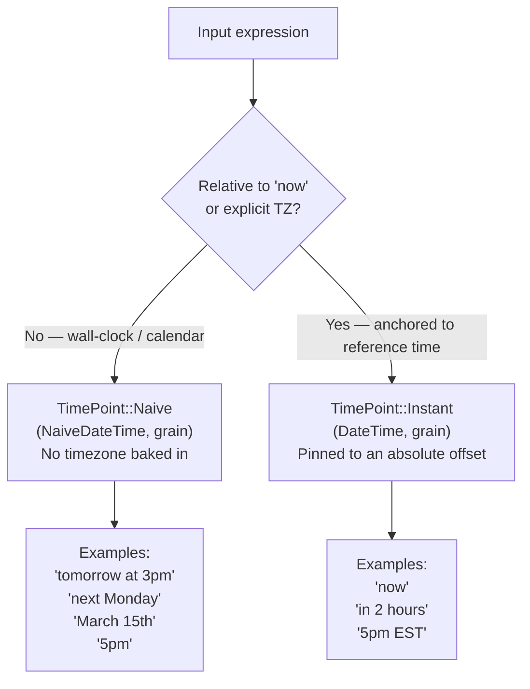

# Public Types

Source files:
- [`src/types.rs`](https://github.com/wafer-inc/duckling/blob/c96b0681ab9a097712b20fe838786a2c65efc537/src/types.rs)
- [`src/dimensions/time_grain/mod.rs`](https://github.com/wafer-inc/duckling/blob/c96b0681ab9a097712b20fe838786a2c65efc537/src/dimensions/time_grain/mod.rs)

All types listed here are re-exported from `src/lib.rs` and are part of the
public API surface.

---

## `Entity` — top-level parse result

```rust
#[derive(Debug, Clone, PartialEq, serde::Serialize)]
pub struct Entity {
    pub body: String,          // matched substring of the input text
    pub start: usize,          // byte offset of match start
    pub end: usize,            // byte offset of match end
    pub value: DimensionValue, // resolved structured value
    pub latent: Option<bool>,  // Some(true) if latent/ambiguous; Some(false) otherwise
}
```

The `latent` field is always `Some(_)` in practice — the resolve layer sets
it unconditionally. It serialises with `#[serde(skip_serializing_if =
"Option::is_none")]`.

Example:

```rust
assert_eq!(
    parse_en("I need 42 widgets", &[DimensionKind::Numeral]),
    vec![Entity {
        body: "42".into(), start: 7, end: 9,
        latent: Some(false),
        value: DimensionValue::Numeral(42.0),
    }]
);
```

---

## `DimensionKind` — filter enum (14 variants)

```rust
#[derive(Debug, Clone, Copy, PartialEq, Eq, Hash)]
pub enum DimensionKind {
    Numeral,
    Ordinal,
    Temperature,
    Distance,
    Volume,
    Quantity,
    AmountOfMoney,
    Email,
    PhoneNumber,
    Url,
    CreditCardNumber,
    TimeGrain,
    Duration,
    Time,
}
```

Implements `Display` — the string values used in serialisation:

| Variant | Display string |
|---------|---------------|
| `Numeral` | `"number"` |
| `Ordinal` | `"ordinal"` |
| `Temperature` | `"temperature"` |
| `Distance` | `"distance"` |
| `Volume` | `"volume"` |
| `Quantity` | `"quantity"` |
| `AmountOfMoney` | `"amount-of-money"` |
| `Email` | `"email"` |
| `PhoneNumber` | `"phone-number"` |
| `Url` | `"url"` |
| `CreditCardNumber` | `"credit-card-number"` |
| `TimeGrain` | `"time-grain"` |
| `Duration` | `"duration"` |
| `Time` | `"time"` |

Passing `&[]` (empty slice) to `parse` enables all 14 dimensions.

---

## `DimensionValue` — resolved value enum (14 variants)

```rust
#[derive(Debug, Clone, PartialEq, serde::Serialize)]
pub enum DimensionValue {
    Numeral(f64),
    Ordinal(i64),
    Temperature(MeasurementValue),
    Distance(MeasurementValue),
    Volume(MeasurementValue),
    Quantity { measurement: MeasurementValue, product: Option<String> },
    AmountOfMoney(MeasurementValue),
    Email(String),
    PhoneNumber(String),
    Url { value: String, domain: String },
    CreditCardNumber { value: String, issuer: String },
    TimeGrain(Grain),
    Duration { value: i64, grain: Grain, normalized_seconds: i64 },
    Time(TimeValue),
}
```

`DimensionValue` also exposes:

```rust
pub fn dim_kind(&self) -> DimensionKind
```

which returns the corresponding `DimensionKind` for the variant.

```mermaid
graph TD
    DV[DimensionValue]
    DV --> Numeral["Numeral(f64)"]
    DV --> Ordinal["Ordinal(i64)"]
    DV --> Temperature["Temperature(MeasurementValue)"]
    DV --> Distance["Distance(MeasurementValue)"]
    DV --> Volume["Volume(MeasurementValue)"]
    DV --> Quantity["Quantity { measurement: MeasurementValue, product: Option<String> }"]
    DV --> AmountOfMoney["AmountOfMoney(MeasurementValue)"]
    DV --> Email["Email(String)"]
    DV --> PhoneNumber["PhoneNumber(String)"]
    DV --> Url["Url { value: String, domain: String }"]
    DV --> CreditCardNumber["CreditCardNumber { value: String, issuer: String }"]
    DV --> TimeGrain["TimeGrain(Grain)"]
    DV --> Duration["Duration { value: i64, grain: Grain, normalized_seconds: i64 }"]
    DV --> Time["Time(TimeValue)"]
```



### Field notes

- `Duration.normalized_seconds` — the count normalised to seconds using fixed
  grain multipliers (day=86400, week=604800, month=2592000, quarter=7776000,
  year=31536000).
- `Quantity.product` — present when the text names what is being measured,
  e.g. `"5 pounds of sugar"` → `product: Some("sugar")`.
- `CreditCardNumber.issuer` — e.g. `"visa"`, `"mastercard"`.

---

## `MeasurementValue` and `MeasurementPoint`

Used by `Temperature`, `Distance`, `Volume`, `Quantity`, and `AmountOfMoney`.

```rust
#[derive(Debug, Clone, PartialEq, serde::Serialize)]
pub enum MeasurementValue {
    Value { value: f64, unit: String },
    Interval { from: Option<MeasurementPoint>, to: Option<MeasurementPoint> },
}

#[derive(Debug, Clone, PartialEq, serde::Serialize)]
pub struct MeasurementPoint {
    pub value: f64,
    pub unit: String,
}
```

Example:

```rust
// "$42.50" → AmountOfMoney(Value { value: 42.5, unit: "USD" })
// "between 3 and 5 dollars" → AmountOfMoney(Interval { from: Some(...), to: Some(...) })
```

---

## `TimeValue` — top-level time result

```rust
#[derive(Debug, Clone, PartialEq, serde::Serialize)]
pub enum TimeValue {
    Single {
        value: TimePoint,
        values: Vec<TimePoint>,      // up to 3 next occurrences, primary is first
        holiday: Option<String>,     // serialised as "holidayBeta" when Some
    },
    Interval {
        from: Option<TimePoint>,
        to: Option<TimePoint>,
        values: Vec<IntervalEndpoints>,  // up to 3 next occurrences
        holiday: Option<String>,         // serialised as "holidayBeta" when Some
    },
}
```

The `holiday` field matches Haskell Duckling's `holiday :: Maybe Text` on
`TimeValue`. It serialises under the JSON key `"holidayBeta"` and is
omitted when `None`.

The `values` field for `Single` contains up to 3 `TimePoint` elements (the
primary value is the first); for `Interval` it contains up to 3
`IntervalEndpoints` — matching Haskell's `TimeValue (SimpleValue v)
[v1, v2, v3] holiday` idiom.

### What populates `values` (occurrences)

No corpus example currently asserts on `values` — the corpus check helpers
(e.g. `datetime()` in
[`src/corpus/mod.rs`](https://github.com/wafer-inc/duckling/blob/c96b0681ab9a097712b20fe838786a2c65efc537/src/corpus/mod.rs))
match against `value` only and ignore `values`/`holiday` with `..`. The
behavior below is derived directly from
[`generate_extra_values`](https://github.com/wafer-inc/duckling/blob/c96b0681ab9a097712b20fe838786a2c65efc537/src/dimensions/time/mod.rs#L286)
and
[`series::generate_series`](https://github.com/wafer-inc/duckling/blob/c96b0681ab9a097712b20fe838786a2c65efc537/src/dimensions/time/series.rs#L724),
not from a written example.

`values` is populated by the **series generator**, which produces up to 3
future occurrences (falling back to past occurrences if none are in the
future) for **recurring/unanchored** time forms — expressions that don't pin
down a single instant. Confirmed recurring forms (`series::generate_series`
match arms): `DayOfWeek`, `Month`, `Hour`/`HourMinute`, `DayOfMonth`, `Year`,
`PartOfDay`, `Weekend`, `Season`, `Holiday` (only when no explicit year is
given), `DateMDY` (month/day without year), and `Composed` combinations of
these.

Concretely: **"christmas"** resolves as `Holiday("Christmas", year_opt: None)`.
[`series_holiday`](https://github.com/wafer-inc/duckling/blob/c96b0681ab9a097712b20fe838786a2c65efc537/src/dimensions/time/series.rs#L478)
shows the fixed-year case (`year_opt: Some(_)`) short-circuits to a single
value with `(vec![], vec![obj])` — so **"christmas 2026"** would NOT get
extra occurrences. Only the unpinned "christmas" walks forward year by year,
giving `values: [<this year's Dec 25>, <next year>, <year after>]`.

Conversely, a fully anchored date like "July 1st 2026" (`DateMDY` with
`year: Some(2026)`) goes through the `Some(y)` branch of
[`series_date_mdy`](https://github.com/wafer-inc/duckling/blob/c96b0681ab9a097712b20fe838786a2c65efc537/src/dimensions/time/series.rs#L575),
which returns a single-element series rather than an empty one — so `values`
still ends up with exactly 1 element, just via the "series produced one
result" path rather than the "series was empty, fall back to primary" path
in `generate_extra_values`. Either way: a year-pinned date never yields 3
occurrences, only an unpinned/recurring form does.

---

## `TimePoint` — single time moment

```rust
#[derive(Debug, Clone, PartialEq, serde::Serialize)]
pub enum TimePoint {
    Instant { value: DateTime<FixedOffset>, grain: Grain },
    Naive   { value: NaiveDateTime,         grain: Grain },
}
```

`TimePoint` also exposes:

```rust
pub fn grain(&self) -> Grain
```

### Naive vs Instant semantics

This distinction is critical for the Ruby type mapping.



**`Naive`** — wall-clock / calendar expressions that carry no timezone. The
parser evaluates them using the reference time's calendar date but does **not**
embed the reference time's offset into the result. The Ruby binding will need
to decide how to handle timezone attachment (e.g. use the caller-supplied
timezone or leave the value as naive).

**`Instant`** — expressions relative to "now" or that name an explicit
timezone. The result is a `DateTime<FixedOffset>` carrying the resolved
absolute moment, including the offset from the reference time or the named TZ.

Verified by source-level integration tests in `src/lib.rs`:

```rust
// "15/2" (DMY in EN-GB locale) → Naive { value: 2013-02-15T00:00:00, grain: Day }
// "in one hour" → Instant { value: 2013-02-12T05:30:00-02:00, grain: Minute }
```

---

## `IntervalEndpoints`

```rust
#[derive(Debug, Clone, PartialEq, serde::Serialize)]
pub struct IntervalEndpoints {
    pub from: Option<TimePoint>,
    pub to: Option<TimePoint>,
}
```

Used in `TimeValue::Interval.values` to represent alternative occurrences of
the interval. Both endpoints may be `None` for open-ended intervals.

---

## `Grain` — time precision

Source: [`src/dimensions/time_grain/mod.rs`](https://github.com/wafer-inc/duckling/blob/c96b0681ab9a097712b20fe838786a2c65efc537/src/dimensions/time_grain/mod.rs)

```rust
#[derive(Debug, Clone, Copy, PartialEq, Eq, Hash, serde::Serialize)]
pub enum Grain {
    NoGrain,
    Second,
    Minute,
    Hour,
    Day,
    Week,
    Month,
    Quarter,
    Year,
}
```

Implements `PartialOrd` + `Ord` ordered smallest-to-largest
(`NoGrain < Second < Minute < Hour < Day < Week < Month < Quarter < Year`).

### Methods

```rust
pub fn as_str(&self) -> &'static str
pub fn from_str(s: &str) -> Grain  // unknown strings fall back to Grain::Second
pub fn grain(&self) -> Grain        // on TimePoint — returns the grain field
pub fn lower(&self) -> Grain        // next finer grain level
pub fn in_seconds(&self, n: i64) -> Option<i64>   // n units → seconds (checked mul)
pub fn one_in_seconds_f64(&self) -> f64
```

### `as_str()` return values

| Grain | `as_str()` |
|-------|-----------|
| `NoGrain` | `"no_grain"` |
| `Second` | `"second"` |
| `Minute` | `"minute"` |
| `Hour` | `"hour"` |
| `Day` | `"day"` |
| `Week` | `"week"` |
| `Month` | `"month"` |
| `Quarter` | `"quarter"` |
| `Year` | `"year"` |

Note: `NoGrain` → `"no_grain"` (with underscore). `from_str("no_grain")` round-trips correctly; unrecognised strings fall back to `Grain::Second`.

### `NoGrain` semantics

`NoGrain` is used only for `now` to mark it as a reference instant with no
precision grain. Its `in_seconds(n)` returns `Some(n)` (treated as seconds).
