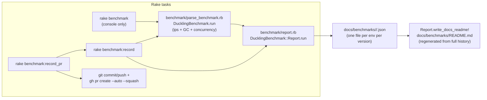

# Benchmark methodology

Research for issue #71 (pool worker threads for Fiber-scheduler dispatch in
`Duckling.parse`). This topic maps the existing benchmark pipeline that any
new pooled-dispatch measurement has to fit into, pins down the exact PR
#50/#64 numbers issue #71 cites, and lays out options for adding a
comparable "pooled dispatch" scenario.

## Table of contents

| Section | What it covers |
|---|---|
| [Current terrain](#current-terrain) | The existing benchmark pipeline and PR #50's actual measured numbers |
| [New territory](#new-territory) | Options for measuring a pooled-dispatch scenario |

## Current terrain

### Pipeline overview

### 1. `benchmark/parse_benchmark.rb` — scenario structure

File: `benchmark/parse_benchmark.rb` (module `DucklingBenchmark`, deliberately
not `Duckling::Benchmark` — see lines 12–15, `require "benchmark/ips"`
defines top-level `::Benchmark` and nesting would shadow it).

- **`CORPUS`** (lines 47–54): six named scenarios — `short`, `medium`,
  `long`, `no_match`, `empty`, `camping_trip_email` — the first four plus
  `empty` mirror the upstream Rust Criterion corpus
  (`wafer-inc/duckling`'s `benches/parse.rs`); `camping_trip_email` (lines
  21–42, an 18-time-entity multi-date email) stress-tests allocation/timing
  scaling with entity *count* per call.
- **`NATIVE_AVAILABLE`** (line 76): `!!defined?(Duckling::Native)`. Gates
  every native-vs-dispatch comparison so `bin/benchmark-replay` can still run
  this harness against pre-issue-#64 checkouts (which only defined
  `Duckling.parse` directly, no `Duckling::Native` split) without raising
  `NameError` — those replays just skip the native-only scenarios.
- **`run_ips`** (lines 78–107) — the dispatch-mode comparison already lives
  here:
  - Wraps the *entire* `Benchmark.ips do |x| ... end` call (registration
    **and** `x.compare!`'s later timed execution) in a single `Sync do
    ... end` block (lines 88–98). The comment at lines 79–87 explains why:
    `x.report` only *registers* a block: `Benchmark.ips` runs it later,
    after the passed block returns, so wrapping only the registration loop
    would measure nothing under an active Fiber scheduler (this exact bug
    was found and fixed mid-PR #50 — see below).
    - `NATIVE_LABEL_SUFFIX = "_native"` (line 70) keys the no-thread
    variant's `ips.report` label (`"#{name}_native"`) so one
    `Benchmark.ips` pass produces both entries without a second
    warmup/measure cycle.
  - For each corpus scenario: reports `Duckling.parse(s[:input], ...)`
    (dispatches through `Thread.new { Native.parse(...) }.value` because
    it's inside `Sync`, i.e. under an installed `Fiber.scheduler`), and if
    `NATIVE_AVAILABLE`, also reports `Duckling::Native.parse(s[:input],
    ...)` directly (no thread spawn ever).
- **`measure_gc`** (lines 109–129) — deliberately measures `Native.parse`,
  *not* `Duckling.parse`: the comment (lines 109–117) records an empirical
  finding that `Duckling.parse`'s thread-per-call dispatch drowns the
  parse-cost signal in Thread allocation churn (observed: objects/call 28 →
  35, minor GC 1 → 62 across one recording when this loop went through
  `Duckling.parse`). Dispatch overhead is reported separately by the ips
  comparison above.
- **`run_concurrency`** (lines 131–159) — 10-thread (`THREAD_COUNT = 10`,
  line 62) vs 1-thread throughput over `CONCURRENCY_DURATION = 3` seconds
  (line 63) on the `medium` scenario (`CONCURRENCY_SCENARIO`, line 64), via
  `Duckling.parse` — **not** wrapped in `Sync`, so no `Fiber.scheduler` is
  installed here and `Duckling.parse` takes its direct-to-`Native.parse`
  fast path (this is the plain-thread-pool / Puma-Sidekiq-style scenario,
  not the Fiber-scheduler one).
- **`run`** (lines 161–190) — assembles everything into one results hash;
  when `NATIVE_AVAILABLE`, computes `thread_overhead_pct` per scenario as
  `(thread_µs - native_µs) / native_µs * 100` (lines 171–172).

### 2. `benchmark/report.rb` and `docs/benchmarks/` conventions

File: `benchmark/report.rb` (module `DucklingBenchmark::Report`).

- **`detect_environment`** (lines 28–36): `"github-actions"` if
  `GITHUB_ACTIONS=true`, `"claude-code-web"` if `CLAUDE_CODE_REMOTE=true`,
  else `"local-#{ruby_minor}"` (e.g. `local-3.4`) — bucketed by Ruby *minor*
  version (comment lines 22–27) since a dev machine's Ruby version drifts
  over a project's lifetime the way a CI runner's doesn't. This local
  bucketing (`local-3.3`/`local-3.4`/`local-4.0`, per
  `ENVIRONMENT_ORDER`, line 19) was introduced in issue #76/PR #79 — before
  that, all local recordings shared one unbucketed `docs/benchmarks/local/`
  directory (see "PR #50's actual numbers" below, which predates the
  bucketing and was recorded under the plain `local` environment name).
- **`write_json`** (lines 40–46): writes
  `docs/benchmarks/<environment>/<version>.json`, payload = the raw
  `DucklingBenchmark.run` results hash merged with `environment`, `version`
  (`Duckling::VERSION`), and `date` (UTC, `%Y-%m-%d`).
- **`history`** (lines 48–52): globs every `docs/benchmarks/*/*.json` file
  and parses it (symbolized keys) — this is the entire "database": no other
  index, just the directory tree.
- **`latest_per_environment`** (lines 54–58): groups by `environment`, takes
  the max by `Gem::Version.new(version)` per group.
- **`build_dispatch_section`** (lines 100–135): this is where the
  native-vs-thread-per-call comparison actually gets rendered for a given
  environment's latest recorded version — a Markdown table plus (if any
  non-excluded scenario exists) a `mermaid xychart-beta` grouped bar chart
  of `native` vs `thread-per-call` ips per scenario (lines 121–133).
  Backward-compatible by construction: `scenarios = entry[:scenarios].select
  { |s| s[:native_ips] }` (line 101) returns `""` for pre-dispatch-schema
  recordings rather than raising.
- **`write_docs_readme!`** (lines 211–213) just writes a string to
  `docs/benchmarks/README.md` — entirely regenerated from `history`, never
  hand-edited (enforced only by convention/comment, not tooling).
- JSON schema per scenario (`docs/benchmarks/<env>/<version>.json`,
  `scenarios[]` entries): `name`, `input`, `ips`, `ips_stddev_pct`,
  `iterations`, `microseconds_per_call`, `allocated_objects_per_call`,
  `minor_gc_count_delta`, `major_gc_count_delta`, and — only for
  recordings made after PR #50 landed — `native_ips`,
  `native_microseconds_per_call`, `thread_overhead_pct`.

### 3. Rakefile tasks and `bin/benchmark`

File: `Rakefile`.

- `task :benchmark_env` (lines 31–39): deletes `RB_SYS_CARGO_PROFILE` from
  `ENV` and re-enables `:compile`, forcing a release-profile rebuild
  regardless of a local `.env.local`'s dev-profile default — every
  benchmark run (console-only or recorded) always measures the release
  build.
- `task benchmark: [:benchmark_env, :compile]` (lines 41–44): runs
  `benchmark/parse_benchmark.rb` directly — console output only, no files
  written. This is what `bin/benchmark` (no args) invokes.
- `namespace :benchmark do task record: [...] end` (lines 46–50): runs
  `benchmark/report.rb`, which both writes the JSON and regenerates the
  README (`Report.run`, `report.rb` lines 215–219). `bin/benchmark record`
  invokes this.
- `task record_pr` (lines 52–80): guarded by `release:guard_clean`; checks
  out a fresh branch off `origin/main`, runs `benchmark:record` there,
  commits `docs/benchmarks`, pushes, and opens+auto-merges a PR via `gh`,
  then restores the original branch. `bin/benchmark record-pr` invokes
  this. This is the task actually run by `.github/workflows/benchmark.yml`
  (`bundle exec rake benchmark:record_pr`) and by CI/local/Claude-Code-Web
  sessions independently, per `AGENTS.md`.
- `bin/benchmark` (`bin/benchmark` lines 1–25): thin wrapper —
  `""`→`rake benchmark`, `record`→`rake benchmark:record`,
  `record-pr`→`rake benchmark:record_pr` — plus JIT gem/extension setup
  when `CLAUDE_CODE_REMOTE=true` (lines 8–15), matching `bin/test`'s
  convention.

**How a new scenario would flow through this pipeline**: nothing about the
Rake tasks or `report.rb` needs to change to add a new *dispatch-mode*
variant — the whole pipeline is schema-agnostic beyond `report.rb`'s
`build_dispatch_section`, which already keys off whatever `native_ips`/
`thread_overhead_pct`-shaped fields exist per scenario entry. A third
dispatch mode (pooled) would need either: (a) a parallel field set (e.g.
`pooled_ips`/`pooled_microseconds_per_call`/`pooled_overhead_pct`) that
`build_dispatch_section` is extended to render as a third bar/column, or
(b) reusing the existing `thread_overhead_pct`/`ips` fields by swapping
what `Duckling.parse`'s Fiber-scheduler path *does* internally (pool vs
per-call spawn) — in which case old and new recordings under the same field
names are the direct "before/after" comparison, at the cost of losing the
ability to show old-vs-new side by side in one recorded JSON file. See
"New territory" below.

### 4. PR #50 / issue #64's actual measured numbers

Issue #71's body states: *"the PR's own benchmarks show +53% to +965% versus
`Native.parse` directly on the fastest scenarios (`empty`/`short`)."*
Verified: this is a precise reference to
`docs/benchmarks/local/0.2.1-rc1.json` **as it existed partway through PR
#50**, before PR #50's own follow-up fix ("Fix dispatch-mode ips benchmark:
measure it under an actual Fiber scheduler", commit `5009b2e`) re-recorded
it. Confirmed via `git log --all -p -- docs/benchmarks`:

| Scenario | native_ips | native µs/call | thread-per-call ips | thread µs/call | `thread_overhead_pct` |
|---|---|---|---|---|---|
| `short` | 1764.67 | 566.68 | 1154.40 | 866.25 | **52.86%** |
| `empty` | 57487.90 | 17.39 | 5396.21 | 185.32 | **965.34%** |

(Ruby 3.4.5, x86_64-darwin24, rustc 1.85.0, `release` cargo profile —
`environment: "local"`, `version: "0.2.1-rc1"`, `date: "2026-07-03"`, from
that superseded JSON blob.) These are the exact two numbers issue #71
rounds to "+53% to +965%".

**Important caveat for planning against these numbers**: per PR #50's own
description (`gh pr view 50`), this *particular* recording was measured
before a real bug fix: `x.report(name) { ... }` inside `Benchmark.ips do |x|
... end` only *registers* a block, and the timed execution
(`job.run`) happens after the surrounding block returns — so wrapping only
the registration loop in `Sync do ... end` measured nothing under an actual
Fiber scheduler (`Fiber.scheduler` was already back to `nil` by execution
time), producing some backwards results on other scenarios. The fix
(wrapping the *entire* `Benchmark.ips` call in `Sync`, `parse_benchmark.rb`
lines 88–98 today) was verified to produce results "consistent in direction
and rough magnitude" with the already-recorded `github-actions`/
`claude-code-web` data. In other words: `short`/`empty`'s 53%/965% numbers
happen to be from a pre-fix recording, but are corroborated (same
scenarios, same rough magnitude and direction) by post-fix recordings.

**Post-fix / current baseline numbers to beat** (present in the repo now,
`docs/benchmarks/*/0.3.0-rc1.json` and `*/0.2.1-rc1.json`, all schema-valid
with `native_ips`/`thread_overhead_pct`):

| Environment | `short` overhead | `empty` overhead | `empty` native_ips | `empty` native µs/call |
|---|---|---|---|---|
| `github-actions` (0.3.0-rc1) | 30.5% | 532.4% | 73583.5 | 13.59 |
| `claude-code-web` (0.3.0-rc1) | 62.6% | 859.7% | 62320.0 | 16.05 |
| `local-3.4` (0.3.0-rc1) | 39.0% | 948.3% | 60677.4 | 16.48 |
| `local-4.0` (0.3.0-rc1) | 46.7% | 982.3% | 60220.8 | 16.61 |
| `local-3.3` (0.3.0-rc1) | *(anomalous — see below)* | 378.8% | 16029.5 | 62.39 |

`local-3.3`'s `0.3.0-rc1.json` shows *negative* overhead on `short`/
`medium`/`long`/`no_match` (e.g. `short`: -60.3%) with a `native_ips` far
lower than every other recording (513.6 vs ~1500-1800 elsewhere) — almost
certainly a noisy/contended recording environment (a busy dev machine, not
a code regression: the `empty`/`camping_trip_email` numbers in the same
file are in the normal range). Don't anchor a "beat this number" target on
that file; the `github-actions` and `claude-code-web` CI-recorded numbers
(consistent, produced by a dedicated runner) or `local-3.4`/`local-4.0` are
more trustworthy baselines.

**Concrete target for a pooled-dispatch scenario**: on the fastest,
most overhead-sensitive scenario (`empty`), `Native.parse` itself takes
roughly 13.6–16.6µs/call (µs range across environments above); a per-call
`Thread.new` spawn adds ~70–180µs on top of that (the overhead is a *fixed
per-call cost*, per the comment in `report.rb` lines 105–111 — negligible
against `long`/`camping_trip_email`'s multi-millisecond baseline, a large
multiplier against `empty`/`short`'s microsecond-scale baseline). A pool
that dispatches onto an already-running thread should bring that added
fixed cost down toward whatever a `Queue#push`/`Queue#pop` handoff plus
condition-variable wakeup costs (typically low single-digit microseconds
in Ruby), which is the concrete number a pooled implementation needs to
approach to satisfy issue #71's "materially closer to `Native.parse`'s
baseline" acceptance criterion.

## New territory

Not prescriptive — these are options for how a "pooled Fiber-scheduler
dispatch" scenario could be added to `parse_benchmark.rb`/`report.rb`, with
tradeoffs, not a recommendation.

### Option A — third dispatch-mode variant alongside the existing two

Mirror the existing `NATIVE_LABEL_SUFFIX` pattern (`parse_benchmark.rb`
line 70) with e.g. `POOLED_LABEL_SUFFIX = "_pooled"`, and inside the same
`Sync` block in `run_ips`, additionally report
`x.report("#{name}_pooled") { <call the pooled-dispatch code path> }`
per corpus scenario. This requires the pooled dispatch path to be
independently callable (not just wired in as `Duckling.parse`'s only
Fiber-scheduler behavior) — e.g. a `Duckling.parse(..., dispatch: :pool)`
knob, or a separate pool-backed method — so old (`Thread.new`) and new
(pool) can be measured side by side in one recording.

- **Pro**: produces one JSON file with all three modes
  (`ips`/`native_ips`/`pooled_ips`), so `report.rb`'s
  `build_dispatch_section` can show a 3-bar chart per scenario and a
  reader gets an apples-to-apples comparison without cross-referencing two
  separate `<version>.json` files.
- **Con**: requires `report.rb` schema/rendering changes (new fields,
  extended `build_dispatch_section`), and requires the implementation to
  expose the old per-call-spawn path as a still-reachable alternative
  (extra surface area) purely for benchmarking purposes, which may not
  otherwise be wanted once the pool ships.

### Option B — reuse the existing schema, compare recordings across versions

Ship the pool as `Duckling.parse`'s only Fiber-scheduler behavior (no
alternate-mode knob), and compare a `docs/benchmarks/<env>/<version-with-
pool>.json` recording's `thread_overhead_pct`/`ips`/`microseconds_per_call`
fields against the pre-pool `<version>.json` already in the repo (e.g.
`0.3.0-rc1.json`'s numbers documented above) as the "before" data point.
`report.rb`'s existing `build_dispatch_section` needs no changes at all —
the field names (`ips`, `native_ips`, `thread_overhead_pct`) still mean the
same thing, just computed with a pool-backed `Duckling.parse` instead of a
`Thread.new`-backed one.

- **Pro**: zero schema/rendering changes; `docs/benchmarks/README.md`
  keeps working exactly as today, and the "before" data is already
  committed in the repo (no need to keep the old code path alive to
  re-measure it).
- **Con**: cross-version, not same-run, comparison — subject to whatever
  environment noise `docs/benchmarks/README.md`'s own caveat already
  documents (a 20-30% swing between runs on different machines/times "is
  normal and not a regression"); no single recorded JSON file shows old and
  new dispatch behavior side by side.

### Option C — dedicated standalone pool-vs-thread-vs-native micro-benchmark

Add a separate script (not folded into `parse_benchmark.rb`/`report.rb` at
all) that runs `Benchmark.ips` directly comparing `Thread.new{}.value`,
pool-dispatch, and a no-op baseline on a trivial workload (not
`Duckling.parse` itself) to isolate *pure dispatch overhead* from
parse-time variance entirely.

- **Pro**: fastest to iterate on during pool implementation (no need to
  rebuild the native extension or run the full corpus to see a dispatch-
  overhead number change); isolates the variable under test.
- **Con**: doesn't produce a number that flows through `docs/benchmarks/`
  or satisfies issue #71's stated acceptance criterion literally
  ("`bin/benchmark`'s dispatch-mode comparison shows..." — this option
  doesn't touch `bin/benchmark` at all), so it would only be a
  development-time aid, not a substitute for A or B for actually closing
  out the issue.

Options A and B both satisfy the literal acceptance criterion (a
`bin/benchmark`-produced comparison); the choice between them is mainly
about whether keeping the pre-pool `Thread.new` code path reachable at
benchmark time (for A) is worth the extra surface area versus trusting the
already-recorded pre-pool JSON files as the "before" baseline (for B).
