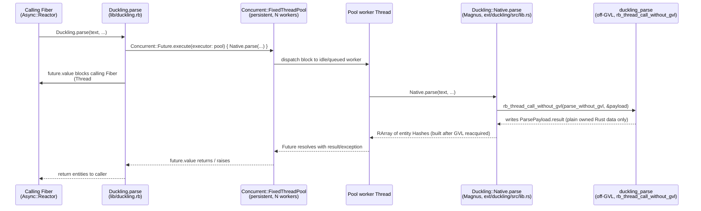

# Research: concurrent-ruby thread pool executors

Candidate for issue #71 — replacing the per-call `Thread.new { Native.parse(...) }.value`
spawn in `Duckling.parse`'s Fiber-scheduler dispatch path
([`lib/duckling.rb:44-47`](../../../../lib/duckling.rb)) with a reusable
worker thread pool.

## Current terrain

Facts about concurrent-ruby as it exists today, independent of this repo.

### Version and release cadence

- Latest release: **1.3.7**, June 16, 2026 ([rubygems.org/gems/concurrent-ruby](https://rubygems.org/gems/concurrent-ruby)).
- Recent history from the same page: 1.3.6 (Dec 13, 2025), 1.3.5 (Jan 15, 2025),
  1.3.4 (Aug 10, 2024), 1.3.3 (Jun 9, 2024). 149 versions total published.
- Cadence is irregular but steady — roughly every 4-7 months over the last two
  years, no gaps longer than ~7 months. Not a fast-moving gem (1.3.x has been
  the stable line since 2022), but not abandoned either.
- GitHub repo ([ruby-concurrency/concurrent-ruby](https://github.com/ruby-concurrency/concurrent-ruby)):
  3,197 commits on `master`, 61 tagged releases, 48 open issues, 3 open PRs at
  time of writing. Maintainer team of 7 listed as active. Issues include a
  "looking-for-contributor" label, suggesting normal open-source triage rather
  than a maintainer bottleneck, though exact median issue-response time
  couldn't be pulled from the GitHub UI in this pass (no public metrics
  dashboard for that repo; would need `gh api` scripting against issue
  timestamps for a precise number).

### Dependabot / automated dependency updates

- The repo's `.github/dependabot.yml` exists and contains:
  ```yaml
  version: 2
  updates:
    - package-ecosystem: "github-actions"
      directory: "/"
      schedule:
        interval: "weekly"
  ```
  ([raw file](https://raw.githubusercontent.com/ruby-concurrency/concurrent-ruby/master/.github/dependabot.yml))
- This only tracks **GitHub Actions** versions, not Ruby/RubyGems dependencies.
  That's consistent with concurrent-ruby's own near-zero runtime dependency
  footprint (it's a pure-Ruby, dependency-light gem) — there's little for a
  RubyGems-ecosystem Dependabot config to track in the first place.

### API shape: submitting work and getting a synchronous result

Two relevant primitives:

- **`Concurrent::FixedThreadPool.new(num_threads, **opts)`** — a pool with a
  fixed worker count. `num_threads` must be a positive integer (raises
  `ArgumentError` otherwise) — this directly satisfies the "pool worker count
  must be configurable" constraint from issue #71, e.g.
  `Concurrent::FixedThreadPool.new(ENV.fetch("DUCKLING_POOL_SIZE", 4).to_i)`.
  Other constructor options: `idletime`, `name`, `max_queue`, `auto_terminate`,
  `fallback_policy` (`:abort` / `:discard` / `:caller_runs`).
  ([API docs](https://ruby-concurrency.github.io/concurrent-ruby/master/Concurrent/FixedThreadPool.html))
- **`#post { ... }`** on any thread-pool executor is fire-and-forget — it
  returns immediately on the calling thread while the block runs on a pool
  worker at some future point. By itself this does **not** give a synchronous
  result back to the caller, which is what `Duckling.parse`'s calling Fiber
  needs (it must yield until *its own* call's result is ready, not just
  enqueue work).
- **`Concurrent::Future.execute(executor: pool) { ... }`** is the piece that
  closes that gap: it wraps a block dispatched onto the given executor and
  exposes `#value` (and `#value!`, which re-raises), which blocks the calling
  thread/Fiber until that specific block's result is available — the same
  synchronous-wait shape `Thread.new { ... }.value` has today, but backed by
  a persistent pool instead of `Thread.new` per call.
  ([thread pool docs](https://github.com/ruby-concurrency/concurrent-ruby/blob/master/docs-source/thread_pools.md))
- A raw `Queue`-based reply channel (push a `[payload, reply_queue]` tuple
  onto the pool's work queue, block on `reply_queue.pop` in the caller) is
  the lower-level equivalent of what `Future` does internally, and remains an
  option if this repo wants to avoid taking `Future`'s slightly heavier API
  surface (state machine, `rescue`/`then` chaining) for a single blocking
  call-and-wait use case.

### Thread lifecycle and shutdown semantics

- Ending a pool cleanly is a three-step sequence: `#shutdown` (stop accepting
  new work, let in-flight tasks finish) → `#wait_for_termination(timeout)`
  (block until drained or timeout) → `#kill` only as a last resort, since
  killing tasks mid-flight is documented as leaving "unpredictable results."
- **`auto_terminate:`** (default `true`) marks pool threads as **daemon
  threads**. Ruby does not wait for daemon threads to finish before the
  process exits, so a `FixedThreadPool` left running with default options
  does not, by itself, keep the process alive or leak a hung process at exit
  — the threads are simply killed by the VM when the last non-daemon thread
  exits. This is a real difference from the JVM-backed JRuby target that
  motivated the option's existence (quoted from the docs: "the application
  will not exit until all thread pools have been shutdown... To prevent
  applications from 'hanging' on exit, all threads can be marked as daemon
  according to the `:auto_terminate` option").
- That said, "the process doesn't hang" is not the same bar as "no leaked
  threads visible mid-run" — issue #71's constraint is that pool threads must
  shut down cleanly with **no leaked threads across the test suite**, which
  cares about `Thread.list` staying clean between/after tests, not just about
  the Ruby process eventually exiting. A pool created once at
  `require`-time (e.g. a `Duckling`-module-level constant) and never
  explicitly shut down would show up as N persistent daemon threads in
  `Thread.list` for the lifetime of the test process — likely fine for a
  single always-on pool, but something a leaked-thread-counting test (in the
  spirit of `test/thread_pool_dispatch_test.rb`'s existing `Thread.new`
  spawn-counting technique) would need to special-case or explicitly account
  for, versus the current code's fully transient per-call `Thread.new`.

### Already a dependency in this repo?

- **No.** `grep -i concurrent Gemfile.lock duckling.gemspec Gemfile` turns up
  nothing. `Gemfile.lock`'s full dependency graph (`async`, `benchmark-ips`,
  `minitest`, `rb_sys`, `standard`/rubocop toolchain, `dotenv`, etc. — see
  [`Gemfile.lock`](../../../../Gemfile.lock)) does not pull it in
  transitively either; `async`/`io-event`/`console`/`metrics`/`traces` (the
  Falcon-adjacent gems already present for `test/falcon_fiber_blocking_test.rb`)
  do not depend on concurrent-ruby. Adopting it would be a **new** runtime
  dependency for `duckling.gemspec`, not something already present for free.

## New territory

How concurrent-ruby's executors would fit this repo's specific dispatch
problem, factually compared against the constraints in the issue.

### Dispatch flow if adopted



### Does this change anything about the Ruby/Rust boundary?

**No — this is purely a Ruby-level dispatch concern, orthogonal to the
GC-safety boundary.** The existing hard rule (no `magnus::Value`/
`magnus::Error` crossing `rb_thread_call_without_gvl`'s callback boundary;
`ParsePayload` holds only owned Rust data — see
[`ext/duckling/src/lib.rs:41-49`](../../../../ext/duckling/src/lib.rs)) lives
entirely inside `Duckling::Native.parse`, which concurrent-ruby never sees or
touches. Whether `Native.parse` is invoked from a bare `Thread.new` block or
from a `Concurrent::Future`/pool-worker block, it's still a single Ruby
method call made from whatever OS thread ends up running it, and that
method's own internals (the `rb_thread_call_without_gvl` call, the
`ParsePayload` struct, the `catch_unwind` guard) are unchanged either way.
Swapping the dispatch mechanism only changes *which Ruby thread* calls
`Native.parse` and *how that thread is obtained/reused* — it does not add,
remove, or relocate anything that crosses the GVL-release boundary itself.

One second-order interaction worth naming: `Native.parse`'s current
GVL-release model assumes each call happens on a full-fledged Ruby `Thread`
(so `rb_thread_call_without_gvl` has a real OS thread to actually block).
concurrent-ruby's `FixedThreadPool` workers are ordinary Ruby `Thread`
objects under the hood (not green threads or Fibers), so this assumption
continues to hold — no different from today's per-call `Thread.new`.

### Comparison against issue #71's constraints

| Constraint | `Thread.new` (current) | `Concurrent::FixedThreadPool` + `Future` |
|---|---|---|
| Configurable worker count | N/A — no pool, unbounded per-call spawn | Native: `FixedThreadPool.new(n)` constructor arg, `n` settable from a module-level config point |
| No `magnus::Value`/`Error` across pool boundary | N/A — not a pool | Unaffected either way (see above); the rule lives inside `Native.parse`, below any dispatch mechanism |
| Clean shutdown, no leaked threads at test-suite/process exit | Trivial — thread is joined and gone after every call | Needs an explicit `pool.shutdown` + `wait_for_termination` at an appropriate lifecycle point (e.g. `at_exit`, or a test-suite teardown) for a persistent pool; `auto_terminate: true` (default) marks workers daemon so the *process* won't hang even if that's skipped, but `Thread.list` still shows the pool's threads for the life of the test process unless explicitly shut down — a new test-suite hygiene concern `test/thread_pool_dispatch_test.rb`'s spawn-counting approach doesn't currently need to handle |
| `test/falcon_fiber_blocking_test.rb` keeps passing | N/A (this is the test that motivated `Thread.new` in the first place) | Confirmed, not just hypothesized: `Future#value` cooperates with `Fiber.scheduler` — see "Empirical verification" below |
| `test/thread_pool_dispatch_test.rb` keeps passing | Passes today (asserts *zero* per-call `Thread.new` for non-Fiber-scheduler callers) | Unaffected in principle — that test only exercises the plain-thread-pool (no-`Fiber.scheduler`) code path, which `lib/duckling.rb:38` already routes straight to `Native.parse(...)` with no thread spawn at all, bypassing any pool dispatch entirely. Adopting a pool for the Fiber-scheduler branch doesn't touch that branch |

### Empirical verification: does `Future#value` cooperate with `Fiber.scheduler`?

Spiked directly with a throwaway script (not run against this repo's actual
`Native.parse` — the question is purely whether `Future#value`'s wait
primitive is Fiber-scheduler-hooked, orthogonal to what work the future
wraps), reusing `test/falcon_fiber_blocking_test.rb`'s ticker/worker harness
inside an `Async::Reactor`: a ticker Fiber records inter-tick gaps while a
worker Fiber calls `Concurrent::Future.execute(executor: Concurrent::FixedThreadPool.new(4)) { sleep(0.05) }.value`.

| Scenario | Work duration | Max ticker gap | Ratio |
|---|---|---|---|
| `Thread.new { sleep }.value` (baseline, today's mechanism) | 0.0507s | 0.0012s | 2.4% |
| `Concurrent::Future.execute(executor: pool) { sleep }.value` | 0.0508s | 0.0014s | 2.8% |

(Ruby 3.3.6, `concurrent-ruby` 1.3.7, `async` 2.42.0.) Both stay at the same
low ratio — no reactor stall in either case; a stall would show a ratio
near 100%. Tracing why: `Future#value`
(`Concurrent::Concern::Obligation#value`) waits on a `Concurrent::Event`
(`concurrent/atomic/event.rb`), which blocks via a `Mutex` +
`ConditionVariable` under `Concurrent::Synchronization::LockableObject` —
not a `Thread#join`/`Thread#value` at all. `Mutex#lock` and
`ConditionVariable#wait` are themselves Fiber-scheduler-hooked (see
[hand-rolled-pool's empirical verification section](../hand-rolled-pool/README.md#empirical-verification-bare-queuepopmutexlockconditionvariablewait-are-fiber-scheduler-hooked)
for the same finding applied to the hand-rolled side), so `Future#value`
cooperates with `Fiber.scheduler` transitively through that wait, without
needing a `Thread#value`-shaped primitive at all.

**This closes the "unverified hypothesis" flagged in the headline finding
of the top-level README and in the comparison table row above:
`Future#value` does let the calling Fiber yield to the reactor for the
work's duration** — confirmed empirically, not just claimed by API-shape
analogy. It also means the "con" recorded against `concurrent-ruby`
elsewhere in this repo's docs (that `IVar#value`/`Future#value` doesn't
know about `Fiber.scheduler` any more than a hand-rolled `Queue` does) no
longer holds: the hand-rolled side of that comparison turns out to already
cooperate too (cross-linked above), which reopens rather than closes the
hand-rolled-vs-`concurrent-ruby` comparison — see that doc's finding and
[the plan's Open Questions](../../plans/01-pool-design-recommendation.md#open-questions)
for what this changes.

### Net assessment (factual, not prescriptive)

concurrent-ruby is a mature, still-maintained, dependency-light gem whose
`FixedThreadPool` + `Future` combination directly maps onto the
"configurable pool size" and "synchronous result back to caller" needs of
issue #71, without touching the existing GC-safety boundary at all — that
boundary is fully contained inside `Native.parse` regardless of what Ruby
code calls it. The one genuinely new piece of surface area it introduces is
pool lifecycle management (a persistent set of daemon threads that need an
explicit shutdown path to avoid showing up as leaked threads in test
teardown, versus today's fully self-cleaning per-call `Thread.new`), plus a
new runtime gemspec dependency that isn't present in this repo today.
