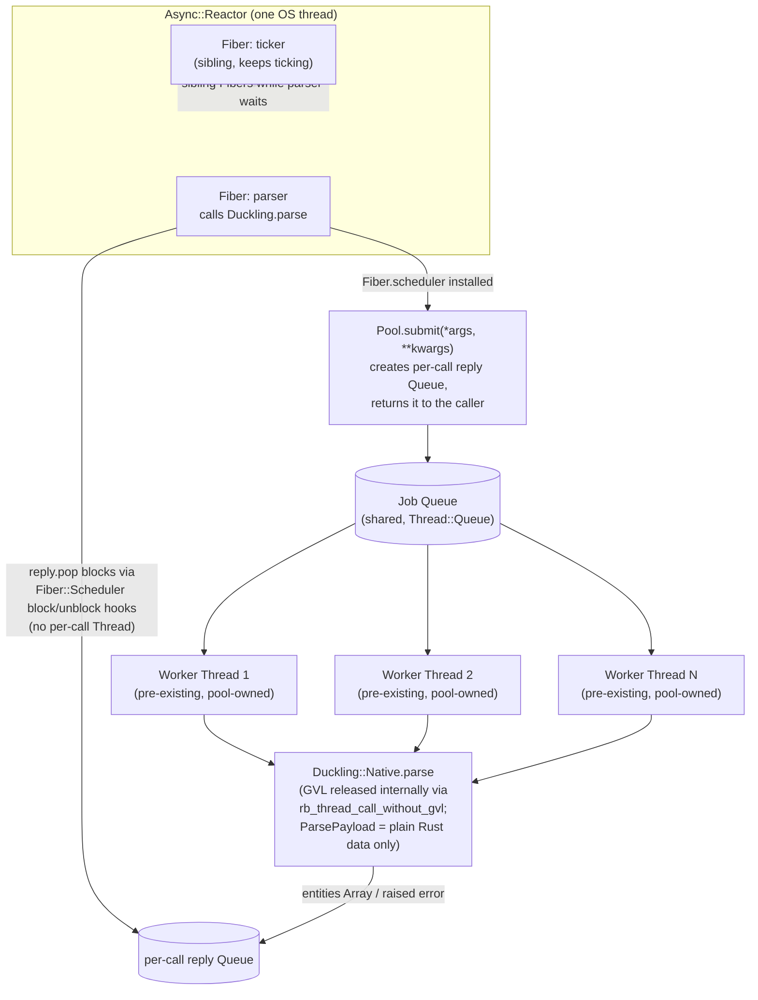

# Research: hand-rolled Ruby worker-thread pool for Fiber-scheduler dispatch

Topic scope (issue #71): could the per-call `Thread.new { Native.parse(...) }.value`
spawn in `Duckling.parse`'s Fiber-scheduler dispatch path be replaced by a
**hand-rolled, stdlib-only Ruby thread pool** (fixed `Thread` array + job
`Queue`, no gem dependency), while preserving the property that a calling
Fiber on an `Async::Reactor` can still yield to sibling Fibers while its
parse runs? This document is a factual terrain map, not a recommendation.

## Current terrain

### Dispatch code today

`lib/duckling.rb:36-48` (`Duckling.parse`):

```ruby
def self.parse(*args, **kwargs, &block)
  reference_time = kwargs[:reference_time]
  if reference_time && !reference_time.is_a?(Time) && reference_time.respond_to?(:to_time)
    kwargs = kwargs.merge(reference_time: reference_time.to_time)
  end

  return Native.parse(*args, **kwargs, &block) unless Fiber.scheduler

  Thread.new do
    Thread.current.report_on_exception = false
    Native.parse(*args, **kwargs, &block)
  end.value
end
```

Two facts pinned by the comments directly above it (`lib/duckling.rb:6-35`):

- `Native.parse` already releases the GVL around the native `duckling::parse`
  call (see `ext/duckling/src/lib.rs:250-258`,
  `rb_sys::rb_thread_call_without_gvl`). A bare GVL release is **not**
  sufficient to unblock an `Async::Reactor`-scheduled Fiber: Ruby 3.4's
  `Fiber::Scheduler#blocking_operation_wait` auto-offload path needs a flag
  `rb_thread_call_without_gvl` never sets.
- Spawning a real background `Thread` and calling `Thread#value` on it works
  today because `Thread#value`/`Thread#join` invoke the installed
  `Fiber.scheduler`'s block/unblock hooks (present since Ruby 3.0), which is
  what actually lets the calling Fiber yield to the reactor. `Thread#value`
  is only *one* of the scheduler-hooked primitives, though — `Queue#pop`,
  `Mutex#lock`, and `ConditionVariable#wait` are hooked too (verified in §3),
  which is what lets a pool drop the per-call thread the current code needs.
  It is this Fiber-cooperative wait the pool must preserve, not
  `Native.parse`'s GVL release itself.
- `Duckling.parse` dispatches through the thread **only** when
  `Fiber.scheduler` is installed on the calling thread (`lib/duckling.rb:42`);
  plain thread-pool callers (Puma/Sidekiq-style — no reactor to yield to)
  call `Native.parse` directly and get their concurrency from the GVL release
  alone. This branch is exactly what `test/thread_pool_dispatch_test.rb`
  pins (asserts zero `Thread.new` calls when no `Fiber.scheduler` is
  installed).
- Inside the spawned thread, `report_on_exception = false` is set as the
  thread's first statement (not after the fact, to avoid a race with a
  fast-failing call) so a rescued native error doesn't also print a
  thread-termination backtrace to stderr; `Thread#value` still re-raises the
  error to the caller as ordinary control flow.

### Native/GC-safety boundary (does NOT change under a pool)

`ext/duckling/src/lib.rs:39-46` (`ParsePayload`) and the comment directly
above it are the concrete instance of this repo's GC-safety rule: **no
`magnus::Value`/`magnus::Error` may cross the `rb_thread_call_without_gvl`
boundary** — only plain owned Rust data (`String`, `Locale`,
`Vec<DimensionKind>`, `Context`, `Options`, `Option<Result<Vec<Entity>, String>>`).
That boundary is entirely inside `Native.parse`'s Rust implementation and is
unconditionally exercised on every call, thread-pool or not — a Ruby-level
worker-thread pool sitting in front of `Native.parse` does not touch it at
all. The values a Ruby-level pool would actually move between threads (the
`text` `String`, `locale`/`dims` `String`/`Array`, `reference_time` `Time`,
`with_latent` `bool` going in; the `RArray` of entity `Hash`es coming out)
are ordinary Ruby objects passed by reference between Ruby `Thread`s under
the GVL — safe today, and unaffected by which dispatch mechanism hands
`Native.parse`'s arguments to it. **The "no magnus::Value across the pool
boundary" constraint from the issue is therefore already satisfied by
`ParsePayload`'s existing design; a hand-rolled Ruby pool doesn't reopen or
need to touch that boundary.**

### Existing tests this pattern must keep passing

- `test/falcon_fiber_blocking_test.rb:85-151` — spins up an `Async::Reactor`
  with a ticker Fiber and a parser Fiber; asserts the ticker's max
  inter-tick gap stays well below the measured `Duckling.parse` duration
  (proportional allowance, `BLOCKING_FRACTION = 0.5`, floor
  `MIN_GAP_ALLOWANCE = 0.025`). This is the test that empirically requires
  whatever replaces `Thread.new{...}.value` to still let the calling Fiber
  yield to the reactor for the call's duration.
- `test/thread_pool_dispatch_test.rb:65-99` — asserts **zero** `Thread.new`
  calls when no `Fiber.scheduler` is installed (a plain
  `POOL_SIZE.times.map { Thread.new { ... } }` harness standing in for
  Puma/Sidekiq). Whatever pool implementation is added must not spawn
  *additional* per-call threads for this path either — the pool's own
  worker threads are created once, at pool-startup time, not per call, so
  this test's assertion (which instruments `Thread.new` calls made *during*
  a `Duckling.parse` call) should remain satisfied as long as pool workers
  are already running before the timed calls happen.

## New territory: hand-rolled `Queue`-based thread pool

### 1. Canonical shape

The idiomatic Ruby stdlib-only worker pool has four parts:

- **Worker array**: `N` `Thread`s created once (at pool-init time, not
  per-call), each running a loop that blocks on `Queue#pop`.
- **Job queue**: a single `Thread::Queue` (or `SizedQueue` to bound
  in-flight work) that callers push job objects onto and workers `pop` from.
  `Queue`/`SizedQueue` are internally `Mutex`+`ConditionVariable`-based and
  thread-safe without extra locking.
- **Result delivery**: each job carries (or is bundled with) a *per-call*
  reply channel — typically a fresh `Queue` (or `Thread::Queue.new` used as
  a single-slot mailbox) created by the caller and closed over by the job
  block, so the worker can push the outcome back to exactly the caller that
  submitted it, without a shared results table needing external
  synchronization. A `Mutex`+`ConditionVariable` pair or a hand-written
  `Concurrent::IVar`-alike (assign a var under a mutex, signal a condvar,
  waiter waits on the condvar) is functionally equivalent to a one-slot
  `Queue` here; a `Queue` is simpler and already covers the "wait for the
  first and only value" case, so most hand-rolled Ruby pools use it instead
  of raw `Mutex`/`ConditionVariable`.
- **Graceful shutdown**: two common conventions, not mutually exclusive:
  - **Poison-pill sentinel**: shutdown pushes one sentinel value (e.g. a
    dedicated singleton object, or `nil` when jobs are never legitimately
    `nil`) per worker onto the job queue; each worker's loop treats popping
    the sentinel as "exit the loop", then the pool `join`s all workers.
    Preferred over `Thread#kill`/`Thread#exit` because it lets an
    in-progress job finish and lets the worker unwind its own stack/ensure
    blocks cleanly, rather than being killed potentially mid-native-call.
  - **`Thread#kill`**: abrupt, does not guarantee ensure-block or in-flight
    native-call cleanup; generally avoided for exactly that reason in code
    that (like this gem) calls into a native extension mid-job.
  - **`at_exit`**: registers the poison-pill shutdown + `join` to run at
    Ruby VM shutdown automatically, so a process that never explicitly
    shuts the pool down still doesn't leave zombie threads referenced past
    exit. Commonly paired with an explicit shutdown method for tests (see
    §4), since relying solely on `at_exit` makes "no leaked threads between
    tests" unverifiable within a single process's Minitest run — `at_exit`
    only fires once, at real process exit.

### 2. Pros/cons vs. a library dependency

The obvious library alternative is `concurrent-ruby` (`Concurrent::FixedThreadPool`
+ `Concurrent::IVar`/`Concurrent::Future`), which is a very common Ruby
dependency already present transitively in many Rails apps (via
`activesupport`), though **not currently a dependency of this gem** (checked:
`duckling.gemspec` declares only `rb_sys` at runtime).

**Hand-rolled, stdlib-only** (this document's remit):
- Pros: zero added runtime gem dependency (this gem currently has exactly
  one runtime dependency, `rb_sys`, and `AGENTS.md` calls that out explicitly
  as needed even for precompiled-gem consumers — adding a second changes
  that story for every consumer); full control over shutdown ordering,
  thread naming (`Thread#name=`, useful for `Thread.list` diagnostics),
  and exactly how many `Thread.new` calls happen for the
  `thread_pool_dispatch_test.rb` assertion to reason about; no version-compat
  surface to track against a gem's own release cadence; the pattern itself
  (`Queue` + fixed workers + poison pill) is short enough (well under 100
  lines) that "more code to maintain" is a modest cost here, not an
  open-ended one.
- Cons: this repo now owns the correctness of the pool/shutdown/leak-free
  guarantees itself — no upstream bug fixes, and any subtle race in the
  hand-rolled shutdown path is this project's to find and fix; needs its own
  dedicated tests (leaked-thread checks, shutdown-under-load, pool-size
  configuration) that a well-exercised library would have already covered
  upstream.

**`concurrent-ruby`**:
- Pros: `Concurrent::FixedThreadPool` + `Concurrent::Promises`/`Concurrent::IVar`
  already handle bounded queueing, shutdown (`#shutdown` + `#wait_for_termination`),
  and are widely used/battle-tested; less new code in this repo.
  `Future#value` cooperates with `Fiber.scheduler` just like a bare
  `Queue#pop` does (verified — see §3, and
  [concurrent-ruby-executors' empirical verification](../concurrent-ruby-executors/README.md#empirical-verification-does-futurevalue-cooperate-with-fiberscheduler)):
  it waits on a `Concurrent::Event` built on `Mutex`+`ConditionVariable`,
  both of which are scheduler-hooked, so it reaches the same zero-per-call-
  thread floor a hand-rolled `Queue` does.
- Cons: new runtime dependency — this gem has exactly one runtime dependency
  today (`rb_sys`, called out in `AGENTS.md`'s "Known gotchas" as needed even
  for precompiled-gem consumers), and adding a second changes that story for
  every consumer, for pool/shutdown mechanics a `Queue` + fixed workers +
  poison pill covers in well under 100 lines of stdlib.

The Fiber-cooperation mechanism (§3) is **not** a discriminator between the
two options: both a hand-rolled `Queue#pop` and `concurrent-ruby`'s
`Future#value` cooperate with `Fiber.scheduler` and reach zero per-call
thread spawns. What separates them is dependency footprint and how much
pool/shutdown code this repo owns versus imports.

### 3. The Fiber-cooperation mechanism (empirically verified)

The design question is what the calling Fiber waits on for its result.
`Queue#pop` blocks the calling **native OS thread**, and the intuitive worry
is that a Fiber calling `reply_queue.pop` on the reactor's one OS thread
would stall the whole reactor — the bug #64 fixed. **A direct spike shows
that worry is unfounded**: under an installed `Fiber.scheduler`, a bare
`Queue#pop` (and `Mutex#lock`, and `ConditionVariable#wait`) called on the
calling Fiber's own thread *does* cooperate with the scheduler — the calling
Fiber yields to the reactor for the wait's duration, exactly like
`Thread#join`/`Thread#value` do today. So the calling Fiber can pop the
reply queue **directly**, with no per-call `Thread.new` wrapper at all.

The spike reused `test/falcon_fiber_blocking_test.rb`'s harness (an
`Async::Reactor` ticker Fiber recording inter-tick gaps, a worker Fiber
blocking on the primitive under test, a separate feeder `Thread` supplying
the wakeup after a fixed delay — modeling a pool worker pushing a result
onto the reply queue):

| Primitive (called directly on the calling Fiber) | Work duration | Max ticker gap | Ratio |
|---|---|---|---|
| `Queue#pop` | 0.104s | 0.0015s | **1.4%** |
| `ConditionVariable#wait` | 0.110s | 0.0014s | **1.3%** |
| CPU busy-wait (control — genuinely stalls) | 0.100s | 0.100s | 100.2% |

(Ruby 3.4.5 and Ruby 3.3.6, `async` 2.42.0; both Ruby versions agree.
`same_os_thread` confirmed `true` for ticker and worker Fibers via
`Thread.current.object_id`, so this is genuinely single-OS-thread
cooperative scheduling, not accidental multi-threading. The CPU-busy-wait
control stalls the reactor at ~100%, confirming the harness actually detects
a stall — so the <2% ratios are meaningful.) `async`'s `Scheduler`
implements the `#block`/`#unblock` `Fiber::Scheduler` hooks
(`async/scheduler.rb`), which back `Thread#join`, `Mutex#lock`,
`Queue#pop`/`push`, `ConditionVariable#wait`, and `SizedQueue#pop`/`push`
per Ruby's `Fiber::Scheduler` design — a broader surface than just
`Thread#value`. This is the same reason today's `Thread.new{...}.value`
works, generalized: it isn't `Thread#value` specifically that the scheduler
intercepts, it's any of these blocking primitives.

```ruby
# ILLUSTRATIVE SKETCH ONLY -- not production code, error handling and
# thread-safety details elided.

module Duckling
  module Pool
    JOB_QUEUE = Queue.new
    SHUTDOWN = Object.new # poison-pill sentinel, distinct from any real job

    def self.start(size: Integer(ENV.fetch("DUCKLING_POOL_SIZE", 4)))
      @workers = Array.new(size) do |i|
        Thread.new do
          Thread.current.name = "duckling-worker-#{i}"
          Thread.current.report_on_exception = false
          loop do
            job = JOB_QUEUE.pop
            break if job.equal?(SHUTDOWN)

            args, kwargs, reply = job
            begin
              reply.push([:ok, Native.parse(*args, **kwargs)])
            rescue => e
              reply.push([:error, e])
            end
          end
        end
      end
    end

    def self.shutdown!
      @workers.size.times { JOB_QUEUE.push(SHUTDOWN) }
      @workers.each(&:join)
      @workers = []
    end

    # Submits a job and returns the caller's per-call reply Queue. The
    # calling Fiber pops it directly -- Queue#pop is scheduler-hooked, so the
    # reactor keeps running while the Fiber waits. No per-call Thread.
    def self.submit(*args, **kwargs)
      reply = Queue.new
      JOB_QUEUE.push([args, kwargs, reply])
      reply
    end
  end
end

# Duckling.parse dispatch, updated:
def self.parse(*args, **kwargs, &block)
  # ...reference_time coercion unchanged...
  return Native.parse(*args, **kwargs, &block) unless Fiber.scheduler

  status, value = Pool.submit(*args, **kwargs, &block).pop
  raise value if status == :error
  value
end
```

This is a genuine improvement over today's
`Thread.new { Native.parse(...) }.value`, on **both** axes: the pool removes
the per-call thread that ran `Native.parse` (replaced by a pre-warmed
worker), *and* the direct `reply.pop` removes the wait itself from needing a
thread. Per-call `Thread.new` count drops from one to **zero** — the calling
Fiber blocks cooperatively on the reply queue on its own thread. The only
`Thread.new` calls in the whole design happen once, at pool startup.

### 4. Clean shutdown across Minitest + process exit

- **Process exit**: `at_exit { Duckling::Pool.shutdown! if @workers }` — a
  guarded call so it's a no-op if the pool was never started (e.g. a process
  that never installed a `Fiber.scheduler` and so never called
  `Pool.submit`, if the pool is started lazily rather than eagerly at
  `require` time).
- **Minitest teardown**: a `Duckling::Pool.shutdown!`-equivalent (or a
  test-only wrapper) called from a shared teardown so a test that starts the
  pool doesn't leak its workers into subsequent tests' `Thread.list`. Given
  `at_exit` only fires once at real interpreter shutdown, it cannot be relied
  upon between individual test files/examples within one `bundle exec rake
  test` run — an explicit shutdown call (whether invoked directly by tests
  or via a Minitest `Minitest.after_run { }` hook) is the only way to make
  "no leaked threads after the suite" independently verifiable per test.
- **Verifying no leaks**: snapshot `Thread.list.size` (or `Thread.list.map(&:object_id)`
  for an exact diff) before pool startup and again after `shutdown!` +
  `join` have returned; assert equality. This is the same style of
  before/after counting `test/thread_pool_dispatch_test.rb` already uses for
  a different property (`Counter` counting `Thread.new` calls via a
  prepended `SpawnCounter` module) — a `Thread.list`-diff test for pool
  shutdown would sit naturally alongside it, exercising the pool's start/stop
  lifecycle directly rather than instrumenting `Thread.new`.
- A subtlety specific to this gem: `test/falcon_fiber_blocking_test.rb` and
  `test/thread_pool_dispatch_test.rb` currently assume `Duckling.parse` is
  immediately ready with no explicit pool-startup step (the dispatch branch
  is purely `Fiber.scheduler ? ... : Native.parse(...)`). Whether pool
  startup should be eager (at `require "duckling"` time) or lazy
  (first-call, memoized) changes where a `Thread.list` baseline needs to be
  captured in a leak test, and interacts with whether a test that never
  triggers the Fiber-scheduler branch (e.g.
  `thread_pool_dispatch_test.rb`, which explicitly skips when
  `Fiber.scheduler` is set) ever starts the pool at all — worth resolving
  before writing the actual leak-detection test, not something this
  research task resolves.

### 5. Configurable pool size

Fits the pattern naturally — the worker-array creation (`Array.new(size) { Thread.new { ... } }`
in §3) already takes `size` as a plain argument, so any of the three
configuration surfaces the issue mentions layers on cleanly:

- **Env var**: `ENV.fetch("DUCKLING_POOL_SIZE", 4).to_i`, read once at
  pool-startup time — simplest, matches this repo's existing
  `.env.local`/`Dotenv.load` convention for other build-time knobs (see
  `Rakefile`'s `RB_SYS_CARGO_PROFILE`), though that convention is currently
  scoped to build-time (Rakefile), not runtime (`lib/duckling.rb`) config —
  worth noting as a precedent, not an exact match.
  it can be overridden after `require` and before first use.
- **`Duckling.configure { |c| c.pool_size = N }` block**: a small
  `Struct`/module-level config object read by `Pool.start`, most idiomatic
  if this gem later grows other runtime-configurable knobs, since it
  centralizes them under one entry point rather than one env var per knob.
- **Kwarg on an explicit start call**: `Duckling::Pool.start(size: N)`,
  simplest if pool startup is explicit/eager rather than implicit/lazy.

All three are compatible with each other (env var as the default, kwarg as
an override) and none requires restructuring the worker-array/job-queue
shape in §3 — pool size is a pure constructor parameter to that pattern,
resolved once before the first worker `Thread.new` runs. The open design
question is *when* that resolution happens (`require` time vs. first-call
lazy vs. explicit `Pool.start`) — orthogonal to whether size is
configurable at all, but it does interact with the "leaked threads across
the test suite" concern in §4 (a lazily-started pool means different tests
may or may not have triggered startup by the time a leak-check runs).

## Proposed pool architecture (Mermaid)



## Open questions this document deliberately leaves unresolved

- Eager vs. lazy pool startup (interacts with §4's leak-testing baseline and
  with whether `thread_pool_dispatch_test.rb`'s no-`Fiber.scheduler` path
  ever touches the pool).
- Exact shutdown-trigger wiring (`at_exit` only, explicit method only, or
  both) and whether Minitest needs a global `after_run` hook or per-file
  teardown.

(The question of whether the calling Fiber can wait on the reply queue
without a per-call `Thread.new` — earlier assumed "no, one thread per call
is the floor" — is now **resolved yes** by the §3 spike: a bare `Queue#pop`
on the calling Fiber cooperates with `Fiber.scheduler`, so no per-call
thread is needed.)
