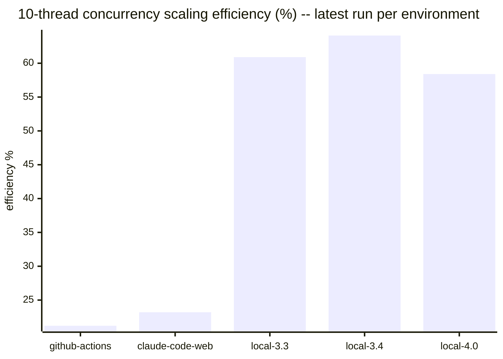

# Benchmark history

Results of the `benchmark-ips` suite in [`../../benchmark/parse_benchmark.rb`](../../benchmark/parse_benchmark.rb),
run against `Duckling.parse` (wall-clock ips, GC/allocation pressure, and
10-thread concurrency scaling). This file is fully auto-generated by
`bundle exec rake benchmark:record` — do not hand-edit it, changes will be
overwritten on the next run.

Results are split **by environment** rather than blended into a single
release-over-release trend. GitHub Actions runners, Claude Code Web
sessions, and local dev machines have too much hardware/scheduling
variance to compare directly — a 20-30% swing between two runs on
different machines is normal and not a regression. Local results are
split further still, **by Ruby minor version** (`local-3.3`,
`local-3.4`, `local-4.0`), since a dev machine's Ruby version changes
over time and native-extension dispatch overhead can shift across
Ruby releases. Comparing an environment against *itself* over time,
or against other environments side by side (as below), is more
meaningful than a single blended number.

Raw JSON lives under `<environment>/<version>.json` in this directory —
one file per environment per recorded version.

## Latest results by environment

### github-actions (v0.3.0-rc3, 2026-07-10)

Ruby 3.3.6 (x86_64-linux), rustc 1.94.1 (e408947bf 2026-03-25), `release` profile.

| Scenario | ips | µs/call | objects/call | minor GC | major GC |
|---|---|---|---|---|---|
| short | 2035.5 | 491.3 | 59.0 | 3 | 0 |
| medium | 1709.8 | 584.9 | 97.0 | 5 | 0 |
| long | 393.8 | 2539.6 | 97.0 | 5 | 0 |
| no_match | 4287.8 | 233.2 | 3.0 | 0 | 0 |
| empty | 11181.6 | 89.4 | 3.0 | 0 | 0 |
| camping_trip_email | 2.3 | 432951.9 | 1413.5 | 0 | 0 |

10-thread throughput: 4649.0 ops/sec vs 2190.7 ops/sec single-threaded (2.12x, 21.2% of ideal linear scaling).

#### Dispatch overhead: native vs thread-per-call (github-actions v0.3.0-rc3)

Thread-per-call is `Duckling.parse` measured with a Fiber scheduler installed (the only condition under which it spawns a background `Thread`, so a calling Fiber can yield to its Async::Reactor while the native call runs); native is `Duckling::Native.parse` (no thread). Without a Fiber scheduler -- a plain Puma/Sidekiq thread pool -- `Duckling.parse` already takes the same fast path as native, paying none of this overhead. Overhead is a fixed per-call cost, not a throughput loss -- negligible against slower scenarios, a real multiplier against the fastest ones.

| Scenario | ips (native) | ips (thread-per-call) | µs/call (native) | µs/call (thread-per-call) | overhead |
|---|---|---|---|---|---|
| short | 2667.1 | 2035.5 | 374.9 | 491.3 | 31.0% |
| medium | 2175.6 | 1709.8 | 459.6 | 584.9 | 27.2% |
| long | 418.4 | 393.8 | 2390.2 | 2539.6 | 6.2% |
| no_match | 7765.4 | 4287.8 | 128.8 | 233.2 | 81.1% |
| empty | 74149.0 | 11181.6 | 13.5 | 89.4 | 563.1% |
| camping_trip_email | 2.3 | 2.3 | 427787.0 | 432951.9 | 1.2% |

### claude-code-web (v0.3.0-rc2, 2026-07-10)

Ruby 3.3.6 (x86_64-linux), rustc 1.94.1 (e408947bf 2026-03-25), `release` profile.

| Scenario | ips | µs/call | objects/call | minor GC | major GC |
|---|---|---|---|---|---|
| short | 1436.5 | 696.1 | 83.0 | 5 | 0 |
| medium | 1263.2 | 791.6 | 149.0 | 10 | 0 |
| long | 332.2 | 3010.5 | 149.0 | 10 | 0 |
| no_match | 3012.4 | 332.0 | 3.0 | 0 | 0 |
| empty | 7559.1 | 132.3 | 3.0 | 0 | 0 |
| camping_trip_email | 2.4 | 416526.6 | 2133.6 | 1 | 0 |

10-thread throughput: 4787.0 ops/sec vs 2064.0 ops/sec single-threaded (2.32x, 23.2% of ideal linear scaling).

#### Dispatch overhead: native vs thread-per-call (claude-code-web v0.3.0-rc2)

Thread-per-call is `Duckling.parse` measured with a Fiber scheduler installed (the only condition under which it spawns a background `Thread`, so a calling Fiber can yield to its Async::Reactor while the native call runs); native is `Duckling::Native.parse` (no thread). Without a Fiber scheduler -- a plain Puma/Sidekiq thread pool -- `Duckling.parse` already takes the same fast path as native, paying none of this overhead. Overhead is a fixed per-call cost, not a throughput loss -- negligible against slower scenarios, a real multiplier against the fastest ones.

| Scenario | ips (native) | ips (thread-per-call) | µs/call (native) | µs/call (thread-per-call) | overhead |
|---|---|---|---|---|---|
| short | 2628.9 | 1436.5 | 380.4 | 696.1 | 83.0% |
| medium | 2131.5 | 1263.2 | 469.1 | 791.6 | 68.7% |
| long | 412.2 | 332.2 | 2426.2 | 3010.5 | 24.1% |
| no_match | 8673.6 | 3012.4 | 115.3 | 332.0 | 187.9% |
| empty | 75690.3 | 7559.1 | 13.2 | 132.3 | 901.3% |
| camping_trip_email | 2.5 | 2.4 | 394949.7 | 416526.6 | 5.5% |

```mermaid
xychart-beta
    title "claude-code-web v0.3.0-rc2: native vs thread-per-call dispatch (ips)"
    x-axis [short, medium, long, no_match, empty]
    y-axis "ips"
    bar "native" [2628.9, 2131.5, 412.2, 8673.6, 75690.3]
    bar "thread-per-call" [1436.5, 1263.2, 332.2, 3012.4, 7559.1]
```

### local-3.3 (v0.3.0-rc2, 2026-07-10)

Ruby 3.3.6 (x86_64-darwin24), rustc 1.85.0 (4d91de4e4 2025-02-17), `release` profile.

| Scenario | ips | µs/call | objects/call | minor GC | major GC |
|---|---|---|---|---|---|
| short | 1107.0 | 903.3 | 83.0 | 5 | 0 |
| medium | 1103.9 | 905.8 | 149.0 | 10 | 0 |
| long | 262.2 | 3814.6 | 149.0 | 10 | 0 |
| no_match | 2208.9 | 452.7 | 3.0 | 0 | 0 |
| empty | 3909.5 | 255.8 | 3.0 | 0 | 0 |
| camping_trip_email | 1.6 | 607167.8 | 2133.9 | 1 | 0 |

10-thread throughput: 9249.3 ops/sec vs 1520.0 ops/sec single-threaded (6.09x, 60.9% of ideal linear scaling).

#### Dispatch overhead: native vs thread-per-call (local-3.3 v0.3.0-rc2)

Thread-per-call is `Duckling.parse` measured with a Fiber scheduler installed (the only condition under which it spawns a background `Thread`, so a calling Fiber can yield to its Async::Reactor while the native call runs); native is `Duckling::Native.parse` (no thread). Without a Fiber scheduler -- a plain Puma/Sidekiq thread pool -- `Duckling.parse` already takes the same fast path as native, paying none of this overhead. Overhead is a fixed per-call cost, not a throughput loss -- negligible against slower scenarios, a real multiplier against the fastest ones.

| Scenario | ips (native) | ips (thread-per-call) | µs/call (native) | µs/call (thread-per-call) | overhead |
|---|---|---|---|---|---|
| short | 1645.1 | 1107.0 | 607.9 | 903.3 | 48.6% |
| medium | 1516.9 | 1103.9 | 659.2 | 905.8 | 37.4% |
| long | 290.7 | 262.2 | 3439.6 | 3814.6 | 10.9% |
| no_match | 5135.9 | 2208.9 | 194.7 | 452.7 | 132.5% |
| empty | 52528.1 | 3909.5 | 19.0 | 255.8 | 1243.6% |
| camping_trip_email | 1.8 | 1.6 | 570563.0 | 607167.8 | 6.4% |

### local-3.4 (v0.3.0-rc2, 2026-07-09)

Ruby 3.4.5 (x86_64-darwin24), rustc 1.85.0 (4d91de4e4 2025-02-17), `release` profile.

| Scenario | ips | µs/call | objects/call | minor GC | major GC |
|---|---|---|---|---|---|
| short | 793.1 | 1260.8 | 83.0 | 3 | 0 |
| medium | 773.6 | 1292.7 | 149.0 | 6 | 0 |
| long | 190.9 | 5237.4 | 149.0 | 6 | 0 |
| no_match | 1677.7 | 596.1 | 3.0 | 0 | 0 |
| empty | 3595.0 | 278.2 | 3.0 | 0 | 0 |
| camping_trip_email | 1.3 | 783123.3 | 2133.6 | 0 | 0 |

10-thread throughput: 6791.7 ops/sec vs 1060.3 ops/sec single-threaded (6.41x, 64.1% of ideal linear scaling).

#### Dispatch overhead: native vs thread-per-call (local-3.4 v0.3.0-rc2)

Thread-per-call is `Duckling.parse` measured with a Fiber scheduler installed (the only condition under which it spawns a background `Thread`, so a calling Fiber can yield to its Async::Reactor while the native call runs); native is `Duckling::Native.parse` (no thread). Without a Fiber scheduler -- a plain Puma/Sidekiq thread pool -- `Duckling.parse` already takes the same fast path as native, paying none of this overhead. Overhead is a fixed per-call cost, not a throughput loss -- negligible against slower scenarios, a real multiplier against the fastest ones.

| Scenario | ips (native) | ips (thread-per-call) | µs/call (native) | µs/call (thread-per-call) | overhead |
|---|---|---|---|---|---|
| short | 1105.4 | 793.1 | 904.6 | 1260.8 | 39.4% |
| medium | 1077.8 | 773.6 | 927.8 | 1292.7 | 39.3% |
| long | 210.0 | 190.9 | 4761.0 | 5237.4 | 10.0% |
| no_match | 3743.2 | 1677.7 | 267.2 | 596.1 | 123.1% |
| empty | 39235.9 | 3595.0 | 25.5 | 278.2 | 991.4% |
| camping_trip_email | 1.3 | 1.3 | 772353.7 | 783123.3 | 1.4% |

### local-4.0 (v0.3.0-rc2, 2026-07-10)

Ruby 4.0.5 (x86_64-darwin24), rustc 1.85.0 (4d91de4e4 2025-02-17), `release` profile.

| Scenario | ips | µs/call | objects/call | minor GC | major GC |
|---|---|---|---|---|---|
| short | 1072.0 | 932.8 | 83.0 | 3 | 0 |
| medium | 1105.7 | 904.4 | 149.0 | 5 | 0 |
| long | 265.7 | 3764.0 | 149.0 | 5 | 0 |
| no_match | 2150.9 | 464.9 | 3.0 | 0 | 0 |
| empty | 4254.3 | 235.1 | 3.0 | 0 | 0 |
| camping_trip_email | 1.6 | 624416.8 | 2133.6 | 0 | 0 |

10-thread throughput: 9124.7 ops/sec vs 1563.3 ops/sec single-threaded (5.84x, 58.4% of ideal linear scaling).

#### Dispatch overhead: native vs thread-per-call (local-4.0 v0.3.0-rc2)

Thread-per-call is `Duckling.parse` measured with a Fiber scheduler installed (the only condition under which it spawns a background `Thread`, so a calling Fiber can yield to its Async::Reactor while the native call runs); native is `Duckling::Native.parse` (no thread). Without a Fiber scheduler -- a plain Puma/Sidekiq thread pool -- `Duckling.parse` already takes the same fast path as native, paying none of this overhead. Overhead is a fixed per-call cost, not a throughput loss -- negligible against slower scenarios, a real multiplier against the fastest ones.

| Scenario | ips (native) | ips (thread-per-call) | µs/call (native) | µs/call (thread-per-call) | overhead |
|---|---|---|---|---|---|
| short | 1618.9 | 1072.0 | 617.7 | 932.8 | 51.0% |
| medium | 1537.8 | 1105.7 | 650.3 | 904.4 | 39.1% |
| long | 290.8 | 265.7 | 3439.0 | 3764.0 | 9.5% |
| no_match | 5305.2 | 2150.9 | 188.5 | 464.9 | 146.7% |
| empty | 54756.8 | 4254.3 | 18.3 | 235.1 | 1187.1% |
| camping_trip_email | 1.8 | 1.6 | 569578.8 | 624416.8 | 9.6% |

```mermaid
xychart-beta
    title "Duckling.parse throughput (ips) -- latest run per environment"
    x-axis [short, medium, long, no_match, empty]
    y-axis "ips"
    bar "github-actions" [2035.5, 1709.8, 393.8, 4287.8, 11181.6]
    bar "claude-code-web" [1436.5, 1263.2, 332.2, 3012.4, 7559.1]
    bar "local-3.3" [1107.0, 1103.9, 262.2, 2208.9, 3909.5]
    bar "local-3.4" [793.1, 773.6, 190.9, 1677.7, 3595.0]
    bar "local-4.0" [1072.0, 1105.7, 265.7, 2150.9, 4254.3]
```

