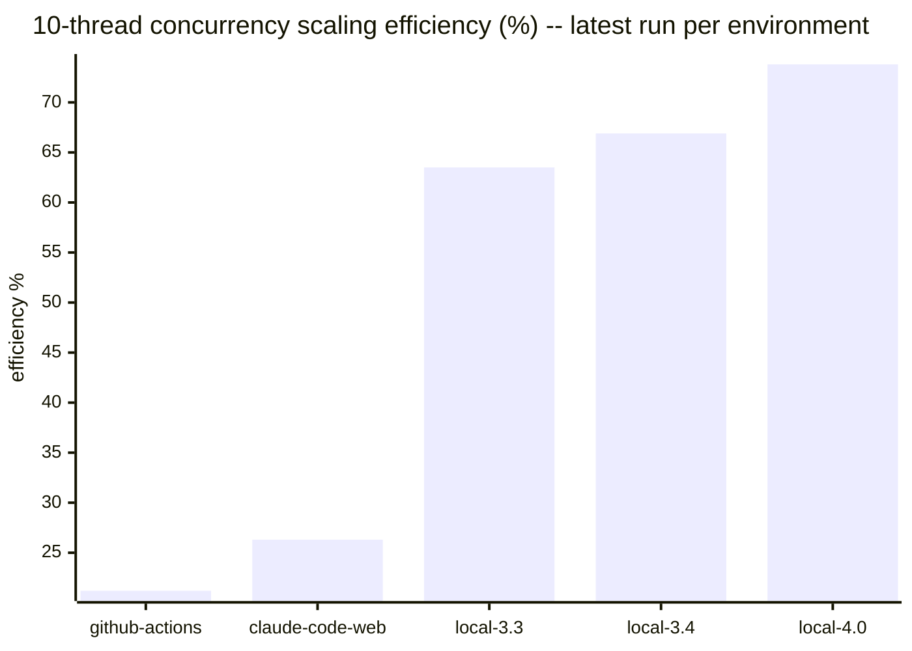

# Benchmark history

Results of the `benchmark-ips` suite in [`../../benchmark/parse_benchmark.rb`](../../benchmark/parse_benchmark.rb),
run against `Duckling.parse` (wall-clock ips, GC/allocation pressure, and
10-thread concurrency scaling). This file is fully auto-generated by
`bundle exec rake benchmark:record` — do not hand-edit it, changes will be
overwritten on the next run.

Results are split **by environment** rather than blended into a single
release-over-release trend. GitHub Actions runners, Claude Code Web
sessions, and local dev machines have too much hardware/scheduling
variance to compare directly — a 20-30% swing between two runs on
different machines is normal and not a regression. Local results are
split further still, **by Ruby minor version** (`local-3.3`,
`local-3.4`, `local-4.0`), since a dev machine's Ruby version changes
over time and native-extension dispatch overhead can shift across
Ruby releases. Comparing an environment against *itself* over time,
or against other environments side by side (as below), is more
meaningful than a single blended number.

Raw JSON lives under `<environment>/<version>.json` in this directory —
one file per environment per recorded version.

## Latest results by environment

### github-actions (v0.3.0-rc3, 2026-07-10)

Ruby 3.3.6 (x86_64-linux), rustc 1.94.1 (e408947bf 2026-03-25), `release` profile.

| Scenario | ips | µs/call | objects/call | minor GC | major GC |
|---|---|---|---|---|---|
| short | 2035.5 | 491.3 | 59.0 | 3 | 0 |
| medium | 1709.8 | 584.9 | 97.0 | 5 | 0 |
| long | 393.8 | 2539.6 | 97.0 | 5 | 0 |
| no_match | 4287.8 | 233.2 | 3.0 | 0 | 0 |
| empty | 11181.6 | 89.4 | 3.0 | 0 | 0 |
| camping_trip_email | 2.3 | 432951.9 | 1413.5 | 0 | 0 |

10-thread throughput: 4649.0 ops/sec vs 2190.7 ops/sec single-threaded (2.12x, 21.2% of ideal linear scaling).

#### Dispatch overhead: native vs thread-per-call (github-actions v0.3.0-rc3)

Thread-per-call is `Duckling.parse` measured with a Fiber scheduler installed (the only condition under which it spawns a background `Thread`, so a calling Fiber can yield to its Async::Reactor while the native call runs); native is `Duckling::Native.parse` (no thread). Without a Fiber scheduler -- a plain Puma/Sidekiq thread pool -- `Duckling.parse` already takes the same fast path as native, paying none of this overhead. Overhead is a fixed per-call cost, not a throughput loss -- negligible against slower scenarios, a real multiplier against the fastest ones.

| Scenario | ips (native) | ips (thread-per-call) | µs/call (native) | µs/call (thread-per-call) | overhead |
|---|---|---|---|---|---|
| short | 2667.1 | 2035.5 | 374.9 | 491.3 | 31.0% |
| medium | 2175.6 | 1709.8 | 459.6 | 584.9 | 27.2% |
| long | 418.4 | 393.8 | 2390.2 | 2539.6 | 6.2% |
| no_match | 7765.4 | 4287.8 | 128.8 | 233.2 | 81.1% |
| empty | 74149.0 | 11181.6 | 13.5 | 89.4 | 563.1% |
| camping_trip_email | 2.3 | 2.3 | 427787.0 | 432951.9 | 1.2% |

### claude-code-web (v0.3.0-rc3, 2026-07-11)

Ruby 3.3.6 (x86_64-linux), rustc 1.94.1 (e408947bf 2026-03-25), `release` profile.

| Scenario | ips | µs/call | objects/call | minor GC | major GC |
|---|---|---|---|---|---|
| short | 1154.4 | 866.2 | 55.0 | 3 | 0 |
| medium | 1064.6 | 939.3 | 91.0 | 5 | 0 |
| long | 284.8 | 3511.8 | 91.0 | 5 | 0 |
| no_match | 2058.0 | 485.9 | 3.0 | 0 | 0 |
| empty | 5994.3 | 166.8 | 3.0 | 0 | 0 |
| camping_trip_email | 2.1 | 486840.0 | 1319.6 | 0 | 0 |

10-thread throughput: 4172.3 ops/sec vs 1587.3 ops/sec single-threaded (2.63x, 26.3% of ideal linear scaling).

#### Dispatch overhead: native vs thread-per-call (claude-code-web v0.3.0-rc3)

Thread-per-call is `Duckling.parse` measured with a Fiber scheduler installed (the only condition under which it spawns a background `Thread`, so a calling Fiber can yield to its Async::Reactor while the native call runs); native is `Duckling::Native.parse` (no thread). Without a Fiber scheduler -- a plain Puma/Sidekiq thread pool -- `Duckling.parse` already takes the same fast path as native, paying none of this overhead. Overhead is a fixed per-call cost, not a throughput loss -- negligible against slower scenarios, a real multiplier against the fastest ones.

| Scenario | ips (native) | ips (thread-per-call) | µs/call (native) | µs/call (thread-per-call) | overhead |
|---|---|---|---|---|---|
| short | 1914.3 | 1154.4 | 522.4 | 866.2 | 65.8% |
| medium | 1636.1 | 1064.6 | 611.2 | 939.3 | 53.7% |
| long | 351.7 | 284.8 | 2843.0 | 3511.8 | 23.5% |
| no_match | 5407.4 | 2058.0 | 184.9 | 485.9 | 162.8% |
| empty | 58280.3 | 5994.3 | 17.2 | 166.8 | 872.3% |
| camping_trip_email | 2.1 | 2.1 | 470578.6 | 486840.0 | 3.5% |

### local-3.3 (v0.3.0-rc3, 2026-07-11)

Ruby 3.3.6 (x86_64-darwin24), rustc 1.85.0 (4d91de4e4 2025-02-17), `release` profile.

| Scenario | ips | µs/call | objects/call | minor GC | major GC |
|---|---|---|---|---|---|
| short | 1175.1 | 851.0 | 59.0 | 3 | 0 |
| medium | 1217.2 | 821.5 | 97.0 | 5 | 0 |
| long | 273.9 | 3651.3 | 97.0 | 5 | 0 |
| no_match | 2464.0 | 405.8 | 3.0 | 0 | 0 |
| empty | 5206.5 | 192.1 | 3.0 | 0 | 0 |
| camping_trip_email | 1.7 | 573488.5 | 1413.5 | 0 | 0 |

10-thread throughput: 10418.3 ops/sec vs 1640.3 ops/sec single-threaded (6.35x, 63.5% of ideal linear scaling).

#### Dispatch overhead: native vs thread-per-call (local-3.3 v0.3.0-rc3)

Thread-per-call is `Duckling.parse` measured with a Fiber scheduler installed (the only condition under which it spawns a background `Thread`, so a calling Fiber can yield to its Async::Reactor while the native call runs); native is `Duckling::Native.parse` (no thread). Without a Fiber scheduler -- a plain Puma/Sidekiq thread pool -- `Duckling.parse` already takes the same fast path as native, paying none of this overhead. Overhead is a fixed per-call cost, not a throughput loss -- negligible against slower scenarios, a real multiplier against the fastest ones.

| Scenario | ips (native) | ips (thread-per-call) | µs/call (native) | µs/call (thread-per-call) | overhead |
|---|---|---|---|---|---|
| short | 1712.3 | 1175.1 | 584.0 | 851.0 | 45.7% |
| medium | 1737.4 | 1217.2 | 575.6 | 821.5 | 42.7% |
| long | 305.6 | 273.9 | 3272.0 | 3651.3 | 11.6% |
| no_match | 5410.4 | 2464.0 | 184.8 | 405.8 | 119.6% |
| empty | 58800.5 | 5206.5 | 17.0 | 192.1 | 1029.4% |
| camping_trip_email | 1.9 | 1.7 | 540411.5 | 573488.5 | 6.1% |

```mermaid
xychart-beta
    title "local-3.3 v0.3.0-rc3: native vs thread-per-call dispatch (ips)"
    x-axis [short, medium, long, no_match, empty]
    y-axis "ips"
    bar "native" [1712.3, 1737.4, 305.6, 5410.4, 58800.5]
    bar "thread-per-call" [1175.1, 1217.2, 273.9, 2464.0, 5206.5]
```

### local-3.4 (v0.3.0-rc3, 2026-07-11)

Ruby 3.4.5 (x86_64-darwin24), rustc 1.85.0 (4d91de4e4 2025-02-17), `release` profile.

| Scenario | ips | µs/call | objects/call | minor GC | major GC |
|---|---|---|---|---|---|
| short | 1116.0 | 896.1 | 59.0 | 2 | 0 |
| medium | 1168.6 | 855.7 | 97.0 | 3 | 0 |
| long | 267.9 | 3733.0 | 97.0 | 3 | 0 |
| no_match | 2056.4 | 486.3 | 3.0 | 0 | 0 |
| empty | 4592.3 | 217.8 | 3.0 | 0 | 0 |
| camping_trip_email | 1.9 | 527204.5 | 1413.6 | 0 | 0 |

10-thread throughput: 10271.7 ops/sec vs 1536.0 ops/sec single-threaded (6.69x, 66.9% of ideal linear scaling).

#### Dispatch overhead: native vs thread-per-call (local-3.4 v0.3.0-rc3)

Thread-per-call is `Duckling.parse` measured with a Fiber scheduler installed (the only condition under which it spawns a background `Thread`, so a calling Fiber can yield to its Async::Reactor while the native call runs); native is `Duckling::Native.parse` (no thread). Without a Fiber scheduler -- a plain Puma/Sidekiq thread pool -- `Duckling.parse` already takes the same fast path as native, paying none of this overhead. Overhead is a fixed per-call cost, not a throughput loss -- negligible against slower scenarios, a real multiplier against the fastest ones.

| Scenario | ips (native) | ips (thread-per-call) | µs/call (native) | µs/call (thread-per-call) | overhead |
|---|---|---|---|---|---|
| short | 1805.7 | 1116.0 | 553.8 | 896.1 | 61.8% |
| medium | 1584.0 | 1168.6 | 631.3 | 855.7 | 35.5% |
| long | 285.3 | 267.9 | 3505.0 | 3733.0 | 6.5% |
| no_match | 5696.3 | 2056.4 | 175.6 | 486.3 | 177.0% |
| empty | 62247.3 | 4592.3 | 16.1 | 217.8 | 1255.5% |
| camping_trip_email | 1.8 | 1.9 | 543200.5 | 527204.5 | -2.9% |

```mermaid
xychart-beta
    title "local-3.4 v0.3.0-rc3: native vs thread-per-call dispatch (ips)"
    x-axis [short, medium, long, no_match, empty]
    y-axis "ips"
    bar "native" [1805.7, 1584.0, 285.3, 5696.3, 62247.3]
    bar "thread-per-call" [1116.0, 1168.6, 267.9, 2056.4, 4592.3]
```

### local-4.0 (v0.3.0-rc3, 2026-07-11)

Ruby 4.0.5 (x86_64-darwin24), rustc 1.85.0 (4d91de4e4 2025-02-17), `release` profile.

| Scenario | ips | µs/call | objects/call | minor GC | major GC |
|---|---|---|---|---|---|
| short | 1187.1 | 842.4 | 59.0 | 2 | 0 |
| medium | 1156.8 | 864.4 | 97.0 | 3 | 0 |
| long | 252.0 | 3968.1 | 97.0 | 3 | 0 |
| no_match | 2435.1 | 410.7 | 3.0 | 0 | 0 |
| empty | 5395.4 | 185.3 | 3.0 | 0 | 0 |
| camping_trip_email | 1.8 | 540556.5 | 1413.6 | 0 | 0 |

10-thread throughput: 10991.3 ops/sec vs 1490.0 ops/sec single-threaded (7.38x, 73.8% of ideal linear scaling).

#### Dispatch overhead: native vs thread-per-call (local-4.0 v0.3.0-rc3)

Thread-per-call is `Duckling.parse` measured with a Fiber scheduler installed (the only condition under which it spawns a background `Thread`, so a calling Fiber can yield to its Async::Reactor while the native call runs); native is `Duckling::Native.parse` (no thread). Without a Fiber scheduler -- a plain Puma/Sidekiq thread pool -- `Duckling.parse` already takes the same fast path as native, paying none of this overhead. Overhead is a fixed per-call cost, not a throughput loss -- negligible against slower scenarios, a real multiplier against the fastest ones.

| Scenario | ips (native) | ips (thread-per-call) | µs/call (native) | µs/call (thread-per-call) | overhead |
|---|---|---|---|---|---|
| short | 1676.1 | 1187.1 | 596.6 | 842.4 | 41.2% |
| medium | 1606.2 | 1156.8 | 622.6 | 864.4 | 38.8% |
| long | 284.6 | 252.0 | 3513.9 | 3968.1 | 12.9% |
| no_match | 5343.9 | 2435.1 | 187.1 | 410.7 | 119.5% |
| empty | 52268.5 | 5395.4 | 19.1 | 185.3 | 868.8% |
| camping_trip_email | 1.8 | 1.8 | 567244.5 | 540556.5 | -4.7% |

```mermaid
xychart-beta
    title "local-4.0 v0.3.0-rc3: native vs thread-per-call dispatch (ips)"
    x-axis [short, medium, long, no_match, empty]
    y-axis "ips"
    bar "native" [1676.1, 1606.2, 284.6, 5343.9, 52268.5]
    bar "thread-per-call" [1187.1, 1156.8, 252.0, 2435.1, 5395.4]
```

```mermaid
xychart-beta
    title "Duckling.parse throughput (ips) -- latest run per environment"
    x-axis [short, medium, long, no_match, empty]
    y-axis "ips"
    bar "github-actions" [2035.5, 1709.8, 393.8, 4287.8, 11181.6]
    bar "claude-code-web" [1154.4, 1064.6, 284.8, 2058.0, 5994.3]
    bar "local-3.3" [1175.1, 1217.2, 273.9, 2464.0, 5206.5]
    bar "local-3.4" [1116.0, 1168.6, 267.9, 2056.4, 4592.3]
    bar "local-4.0" [1187.1, 1156.8, 252.0, 2435.1, 5395.4]
```

