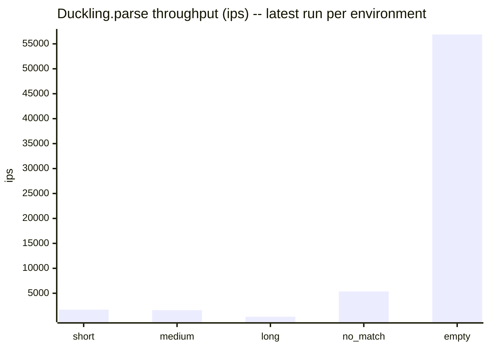
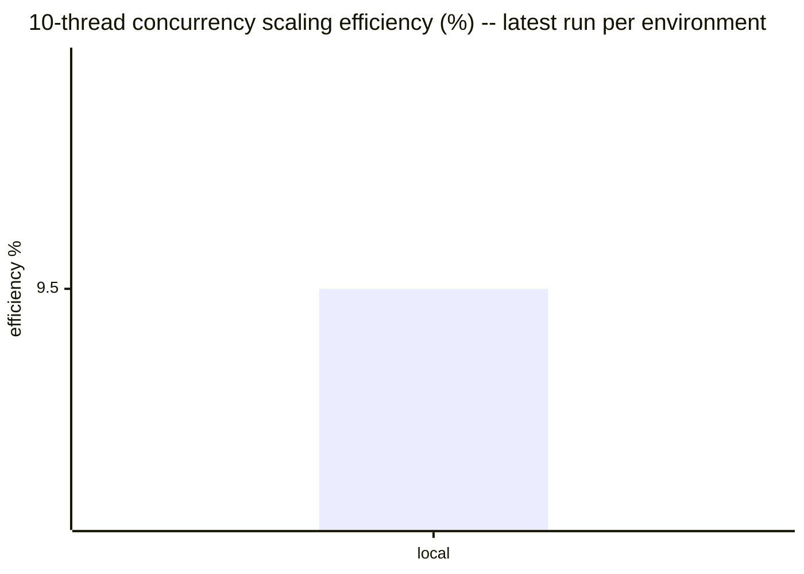

# Benchmark history

Results of the `benchmark-ips` suite in [`../../benchmark/parse_benchmark.rb`](../../benchmark/parse_benchmark.rb),
run against `Duckling.parse` (wall-clock ips, GC/allocation pressure, and
10-thread concurrency scaling). This file is fully auto-generated by
`bundle exec rake benchmark:record` — do not hand-edit it, changes will be
overwritten on the next run.

Results are split **by environment** rather than blended into a single
release-over-release trend. GitHub Actions runners, Claude Code Web
sessions, and local dev machines have too much hardware/scheduling
variance to compare directly — a 20-30% swing between two runs on
different machines is normal and not a regression. Comparing an
environment against *itself* over time, or against other environments
side by side (as below), is more meaningful than a single blended number.

Raw JSON lives under `<environment>/<version>.json` in this directory —
one file per environment per recorded version.

## Latest results by environment

### local (v0.2.0, 2026-07-02)

Ruby 3.4.5 (x86_64-darwin24), rustc 1.85.0 (4d91de4e4 2025-02-17), `release` profile.

| Scenario | ips | µs/call | objects/call | minor GC | major GC |
|---|---|---|---|---|---|
| short | 1719.6 | 581.5 | 28.0 | 1 | 0 |
| medium | 1627.0 | 614.6 | 31.0 | 1 | 0 |
| long | 297.9 | 3356.3 | 31.0 | 1 | 0 |
| no_match | 5360.4 | 186.6 | 3.0 | 0 | 0 |
| empty | 56873.1 | 17.6 | 3.0 | 0 | 0 |

10-thread throughput: 1611.3 ops/sec vs 1687.3 ops/sec single-threaded (0.95x, 9.5% of ideal linear scaling).

