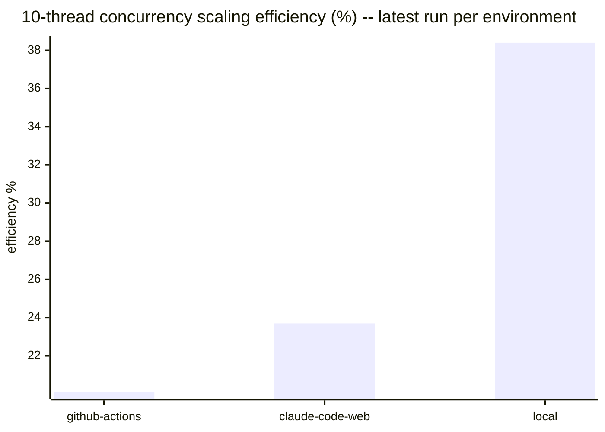

# Benchmark history

Results of the `benchmark-ips` suite in [`../../benchmark/parse_benchmark.rb`](../../benchmark/parse_benchmark.rb),
run against `Duckling.parse` (wall-clock ips, GC/allocation pressure, and
10-thread concurrency scaling). This file is fully auto-generated by
`bundle exec rake benchmark:record` — do not hand-edit it, changes will be
overwritten on the next run.

Results are split **by environment** rather than blended into a single
release-over-release trend. GitHub Actions runners, Claude Code Web
sessions, and local dev machines have too much hardware/scheduling
variance to compare directly — a 20-30% swing between two runs on
different machines is normal and not a regression. Comparing an
environment against *itself* over time, or against other environments
side by side (as below), is more meaningful than a single blended number.

Raw JSON lives under `<environment>/<version>.json` in this directory —
one file per environment per recorded version.

## Latest results by environment

### github-actions (v0.2.0, 2026-07-04)

Ruby 3.3.6 (x86_64-linux), rustc 1.94.1 (e408947bf 2026-03-25), `release` profile.

| Scenario | ips | µs/call | objects/call | minor GC | major GC |
|---|---|---|---|---|---|
| short | 2130.8 | 469.3 | 28.0 | 1 | 0 |
| medium | 1804.9 | 554.0 | 31.0 | 1 | 0 |
| long | 392.7 | 2546.8 | 31.0 | 1 | 0 |
| no_match | 4480.0 | 223.2 | 3.0 | 0 | 0 |
| empty | 12615.7 | 79.3 | 3.0 | 0 | 0 |
| camping_trip_email | 2.3 | 431036.7 | 514.4 | 0 | 0 |

10-thread throughput: 3547.7 ops/sec vs 1761.3 ops/sec single-threaded (2.01x, 20.1% of ideal linear scaling).

#### Dispatch overhead: native vs thread-per-call (github-actions v0.2.0)

Thread-per-call is `Duckling.parse` (the public API) spawning a background `Thread` so a calling Fiber can yield to an Async::Reactor while the native call runs; native is `Duckling::Native.parse` (no thread, the pre-#64 baseline). Overhead is a fixed per-call cost, not a throughput loss -- negligible against slower scenarios, a real multiplier against the fastest ones.

| Scenario | ips (native) | ips (thread-per-call) | µs/call (native) | µs/call (thread-per-call) | overhead |
|---|---|---|---|---|---|
| short | 2662.2 | 2130.8 | 375.6 | 469.3 | 24.9% |
| medium | 2216.9 | 1804.9 | 451.1 | 554.0 | 22.8% |
| long | 419.1 | 392.7 | 2386.3 | 2546.8 | 6.7% |
| no_match | 7614.2 | 4480.0 | 131.3 | 223.2 | 70.0% |
| empty | 72838.8 | 12615.7 | 13.7 | 79.3 | 477.4% |
| camping_trip_email | 2.4 | 2.3 | 423985.5 | 431036.7 | 1.7% |

```mermaid
xychart-beta
    title "github-actions v0.2.0: native vs thread-per-call dispatch (ips)"
    x-axis [short, medium, long, no_match, empty]
    y-axis "ips"
    bar "native" [2662.2, 2216.9, 419.1, 7614.2, 72838.8]
    bar "thread-per-call" [2130.8, 1804.9, 392.7, 4480.0, 12615.7]
```

### claude-code-web (v0.2.0, 2026-07-04)

Ruby 3.3.6 (x86_64-linux), rustc 1.94.1 (e408947bf 2026-03-25), `release` profile.

| Scenario | ips | µs/call | objects/call | minor GC | major GC |
|---|---|---|---|---|---|
| short | 1773.1 | 564.0 | 28.0 | 1 | 0 |
| medium | 1577.3 | 634.0 | 31.0 | 1 | 0 |
| long | 373.4 | 2678.2 | 31.0 | 1 | 0 |
| no_match | 3561.1 | 280.8 | 3.0 | 0 | 0 |
| empty | 10446.8 | 95.7 | 3.0 | 0 | 0 |
| camping_trip_email | 2.4 | 411635.5 | 514.4 | 0 | 0 |

10-thread throughput: 3757.3 ops/sec vs 1588.0 ops/sec single-threaded (2.37x, 23.7% of ideal linear scaling).

#### Dispatch overhead: native vs thread-per-call (claude-code-web v0.2.0)

Thread-per-call is `Duckling.parse` (the public API) spawning a background `Thread` so a calling Fiber can yield to an Async::Reactor while the native call runs; native is `Duckling::Native.parse` (no thread, the pre-#64 baseline). Overhead is a fixed per-call cost, not a throughput loss -- negligible against slower scenarios, a real multiplier against the fastest ones.

| Scenario | ips (native) | ips (thread-per-call) | µs/call (native) | µs/call (thread-per-call) | overhead |
|---|---|---|---|---|---|
| short | 2898.0 | 1773.1 | 345.1 | 564.0 | 63.4% |
| medium | 2454.8 | 1577.3 | 407.4 | 634.0 | 55.6% |
| long | 417.3 | 373.4 | 2396.5 | 2678.2 | 11.8% |
| no_match | 8452.9 | 3561.1 | 118.3 | 280.8 | 137.4% |
| empty | 74858.9 | 10446.8 | 13.4 | 95.7 | 616.6% |
| camping_trip_email | 2.5 | 2.4 | 396307.9 | 411635.5 | 3.9% |

```mermaid
xychart-beta
    title "claude-code-web v0.2.0: native vs thread-per-call dispatch (ips)"
    x-axis [short, medium, long, no_match, empty]
    y-axis "ips"
    bar "native" [2898.0, 2454.8, 417.3, 8452.9, 74858.9]
    bar "thread-per-call" [1773.1, 1577.3, 373.4, 3561.1, 10446.8]
```

### local (v0.2.0, 2026-07-03)

Ruby 3.4.5 (x86_64-darwin24), rustc 1.85.0 (4d91de4e4 2025-02-17), `release` profile.

| Scenario | ips | µs/call | objects/call | minor GC | major GC |
|---|---|---|---|---|---|
| short | 1154.4 | 866.3 | 35.2 | 62 | 0 |
| medium | 1095.9 | 912.5 | 38.2 | 59 | 1 |
| long | 279.2 | 3581.8 | 38.2 | 60 | 0 |
| no_match | 2477.0 | 403.7 | 10.0 | 61 | 0 |
| empty | 5396.2 | 185.3 | 10.0 | 60 | 1 |
| camping_trip_email | 1.8 | 552180.2 | 521.4 | 0 | 0 |

10-thread throughput: 4023.3 ops/sec vs 1048.0 ops/sec single-threaded (3.84x, 38.4% of ideal linear scaling).

#### Dispatch overhead: native vs thread-per-call (local v0.2.0)

Thread-per-call is `Duckling.parse` (the public API) spawning a background `Thread` so a calling Fiber can yield to an Async::Reactor while the native call runs; native is `Duckling::Native.parse` (no thread, the pre-#64 baseline). Overhead is a fixed per-call cost, not a throughput loss -- negligible against slower scenarios, a real multiplier against the fastest ones.

| Scenario | ips (native) | ips (thread-per-call) | µs/call (native) | µs/call (thread-per-call) | overhead |
|---|---|---|---|---|---|
| short | 1764.7 | 1154.4 | 566.7 | 866.3 | 52.9% |
| medium | 1752.8 | 1095.9 | 570.5 | 912.5 | 59.9% |
| long | 317.0 | 279.2 | 3155.1 | 3581.8 | 13.5% |
| no_match | 5523.6 | 2477.0 | 181.0 | 403.7 | 123.0% |
| empty | 57487.9 | 5396.2 | 17.4 | 185.3 | 965.3% |
| camping_trip_email | 1.8 | 1.8 | 540948.2 | 552180.2 | 2.1% |

```mermaid
xychart-beta
    title "local v0.2.0: native vs thread-per-call dispatch (ips)"
    x-axis [short, medium, long, no_match, empty]
    y-axis "ips"
    bar "native" [1764.7, 1752.8, 317.0, 5523.6, 57487.9]
    bar "thread-per-call" [1154.4, 1095.9, 279.2, 2477.0, 5396.2]
```

```mermaid
xychart-beta
    title "Duckling.parse throughput (ips) -- latest run per environment"
    x-axis [short, medium, long, no_match, empty]
    y-axis "ips"
    bar "github-actions" [2130.8, 1804.9, 392.7, 4480.0, 12615.7]
    bar "claude-code-web" [1773.1, 1577.3, 373.4, 3561.1, 10446.8]
    bar "local" [1154.4, 1095.9, 279.2, 2477.0, 5396.2]
```

