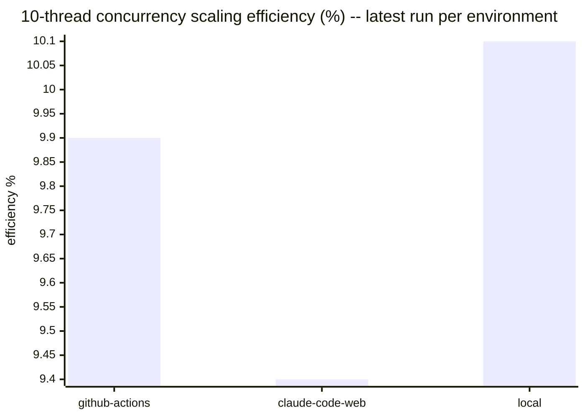

# Benchmark history

Results of the `benchmark-ips` suite in [`../../benchmark/parse_benchmark.rb`](../../benchmark/parse_benchmark.rb),
run against `Duckling.parse` (wall-clock ips, GC/allocation pressure, and
10-thread concurrency scaling). This file is fully auto-generated by
`bundle exec rake benchmark:record` — do not hand-edit it, changes will be
overwritten on the next run.

Results are split **by environment** rather than blended into a single
release-over-release trend. GitHub Actions runners, Claude Code Web
sessions, and local dev machines have too much hardware/scheduling
variance to compare directly — a 20-30% swing between two runs on
different machines is normal and not a regression. Comparing an
environment against *itself* over time, or against other environments
side by side (as below), is more meaningful than a single blended number.

Raw JSON lives under `<environment>/<version>.json` in this directory —
one file per environment per recorded version.

## Latest results by environment

### github-actions (v0.2.0, 2026-07-03)

Ruby 3.3.6 (x86_64-linux), rustc 1.94.1 (e408947bf 2026-03-25), `release` profile.

| Scenario | ips | µs/call | objects/call | minor GC | major GC |
|---|---|---|---|---|---|
| short | 2820.1 | 354.6 | 28.0 | 1 | 0 |
| medium | 2314.0 | 432.1 | 31.0 | 1 | 0 |
| long | 421.7 | 2371.5 | 31.0 | 1 | 0 |
| no_match | 7877.8 | 126.9 | 3.0 | 0 | 0 |
| empty | 73909.9 | 13.5 | 3.0 | 0 | 0 |
| camping_trip_email | 2.4 | 424346.4 | 514.4 | 0 | 0 |

10-thread throughput: 2270.7 ops/sec vs 2298.0 ops/sec single-threaded (0.99x, 9.9% of ideal linear scaling).

### claude-code-web (v0.2.0, 2026-07-03)

Ruby 3.3.6 (x86_64-linux), rustc 1.94.1 (e408947bf 2026-03-25), `release` profile.

| Scenario | ips | µs/call | objects/call | minor GC | major GC |
|---|---|---|---|---|---|
| short | 2135.1 | 468.4 | 28.0 | 1 | 0 |
| medium | 1852.3 | 539.9 | 31.0 | 1 | 0 |
| long | 366.0 | 2731.9 | 31.0 | 1 | 0 |
| no_match | 6362.9 | 157.2 | 3.0 | 0 | 0 |
| empty | 61108.3 | 16.4 | 3.0 | 0 | 0 |
| camping_trip_email | 2.2 | 456857.8 | 514.4 | 0 | 0 |

10-thread throughput: 1692.7 ops/sec vs 1804.3 ops/sec single-threaded (0.94x, 9.4% of ideal linear scaling).

### local (v0.2.0, 2026-07-02)

Ruby 3.4.5 (x86_64-darwin24), rustc 1.85.0 (4d91de4e4 2025-02-17), `release` profile.

| Scenario | ips | µs/call | objects/call | minor GC | major GC |
|---|---|---|---|---|---|
| short | 1474.4 | 678.3 | 28.0 | 1 | 0 |
| medium | 1448.1 | 690.5 | 31.0 | 2 | 0 |
| long | 265.1 | 3772.4 | 31.0 | 2 | 0 |
| no_match | 4686.9 | 213.4 | 3.0 | 0 | 0 |
| empty | 41481.2 | 24.1 | 3.0 | 0 | 0 |
| camping_trip_email | 1.3 | 791063.3 | 514.4 | 0 | 0 |

10-thread throughput: 1661.0 ops/sec vs 1643.7 ops/sec single-threaded (1.01x, 10.1% of ideal linear scaling).

```mermaid
xychart-beta
    title "Duckling.parse throughput (ips) -- latest run per environment"
    x-axis [short, medium, long, no_match, empty]
    y-axis "ips"
    bar "github-actions" [2820.1, 2314.0, 421.7, 7877.8, 73909.9]
    bar "claude-code-web" [2135.1, 1852.3, 366.0, 6362.9, 61108.3]
    bar "local" [1474.4, 1448.1, 265.1, 4686.9, 41481.2]
```

