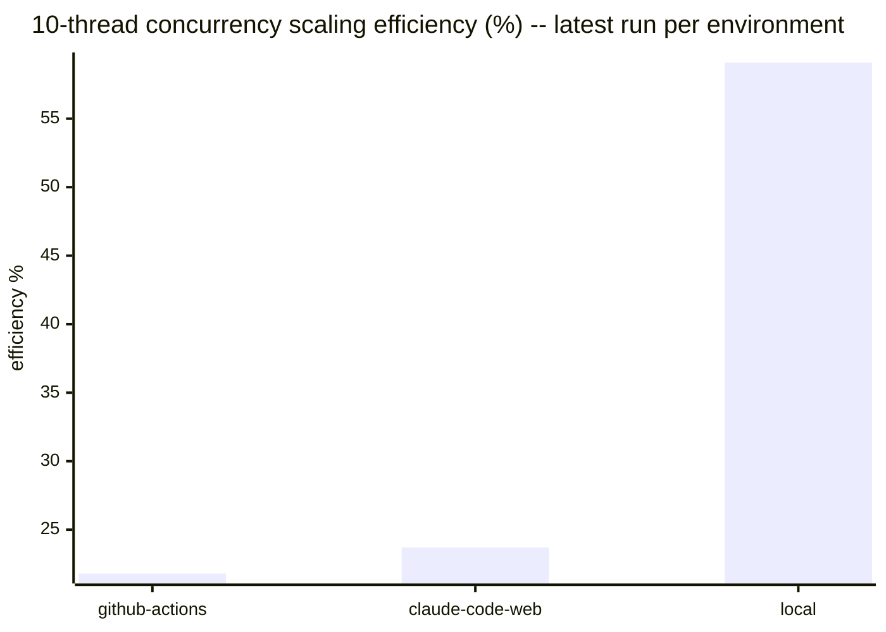

# Benchmark history

Results of the `benchmark-ips` suite in [`../../benchmark/parse_benchmark.rb`](../../benchmark/parse_benchmark.rb),
run against `Duckling.parse` (wall-clock ips, GC/allocation pressure, and
10-thread concurrency scaling). This file is fully auto-generated by
`bundle exec rake benchmark:record` — do not hand-edit it, changes will be
overwritten on the next run.

Results are split **by environment** rather than blended into a single
release-over-release trend. GitHub Actions runners, Claude Code Web
sessions, and local dev machines have too much hardware/scheduling
variance to compare directly — a 20-30% swing between two runs on
different machines is normal and not a regression. Comparing an
environment against *itself* over time, or against other environments
side by side (as below), is more meaningful than a single blended number.

Raw JSON lives under `<environment>/<version>.json` in this directory —
one file per environment per recorded version.

## Latest results by environment

### github-actions (v0.3.0-rc1, 2026-07-04)

Ruby 3.3.6 (x86_64-linux), rustc 1.94.1 (e408947bf 2026-03-25), `release` profile.

| Scenario | ips | µs/call | objects/call | minor GC | major GC |
|---|---|---|---|---|---|
| short | 2064.6 | 484.4 | 28.0 | 1 | 0 |
| medium | 1785.9 | 559.9 | 31.0 | 2 | 0 |
| long | 391.5 | 2554.6 | 31.0 | 2 | 0 |
| no_match | 4382.0 | 228.2 | 3.0 | 0 | 0 |
| empty | 11636.2 | 85.9 | 3.0 | 0 | 0 |
| camping_trip_email | 2.3 | 439296.6 | 514.4 | 0 | 0 |

10-thread throughput: 4814.0 ops/sec vs 2209.3 ops/sec single-threaded (2.18x, 21.8% of ideal linear scaling).

#### Dispatch overhead: native vs thread-per-call (github-actions v0.3.0-rc1)

Thread-per-call is `Duckling.parse` measured with a Fiber scheduler installed (the only condition under which it spawns a background `Thread`, so a calling Fiber can yield to its Async::Reactor while the native call runs); native is `Duckling::Native.parse` (no thread). Without a Fiber scheduler -- a plain Puma/Sidekiq thread pool -- `Duckling.parse` already takes the same fast path as native, paying none of this overhead. Overhead is a fixed per-call cost, not a throughput loss -- negligible against slower scenarios, a real multiplier against the fastest ones.

| Scenario | ips (native) | ips (thread-per-call) | µs/call (native) | µs/call (thread-per-call) | overhead |
|---|---|---|---|---|---|
| short | 2695.0 | 2064.6 | 371.1 | 484.4 | 30.5% |
| medium | 2222.8 | 1785.9 | 449.9 | 559.9 | 24.5% |
| long | 419.6 | 391.5 | 2383.3 | 2554.6 | 7.2% |
| no_match | 7683.6 | 4382.0 | 130.1 | 228.2 | 75.3% |
| empty | 73583.5 | 11636.2 | 13.6 | 85.9 | 532.4% |
| camping_trip_email | 2.4 | 2.3 | 425430.0 | 439296.6 | 3.3% |

```mermaid
xychart-beta
    title "github-actions v0.3.0-rc1: native vs thread-per-call dispatch (ips)"
    x-axis [short, medium, long, no_match, empty]
    y-axis "ips"
    bar "native" [2695.0, 2222.8, 419.6, 7683.6, 73583.5]
    bar "thread-per-call" [2064.6, 1785.9, 391.5, 4382.0, 11636.2]
```

### claude-code-web (v0.2.1-rc1, 2026-07-04)

Ruby 3.3.6 (x86_64-linux), rustc 1.94.1 (e408947bf 2026-03-25), `release` profile.

| Scenario | ips | µs/call | objects/call | minor GC | major GC |
|---|---|---|---|---|---|
| short | 1773.1 | 564.0 | 28.0 | 1 | 0 |
| medium | 1577.3 | 634.0 | 31.0 | 1 | 0 |
| long | 373.4 | 2678.2 | 31.0 | 1 | 0 |
| no_match | 3561.1 | 280.8 | 3.0 | 0 | 0 |
| empty | 10446.8 | 95.7 | 3.0 | 0 | 0 |
| camping_trip_email | 2.4 | 411635.5 | 514.4 | 0 | 0 |

10-thread throughput: 3757.3 ops/sec vs 1588.0 ops/sec single-threaded (2.37x, 23.7% of ideal linear scaling).

#### Dispatch overhead: native vs thread-per-call (claude-code-web v0.2.1-rc1)

Thread-per-call is `Duckling.parse` measured with a Fiber scheduler installed (the only condition under which it spawns a background `Thread`, so a calling Fiber can yield to its Async::Reactor while the native call runs); native is `Duckling::Native.parse` (no thread). Without a Fiber scheduler -- a plain Puma/Sidekiq thread pool -- `Duckling.parse` already takes the same fast path as native, paying none of this overhead. Overhead is a fixed per-call cost, not a throughput loss -- negligible against slower scenarios, a real multiplier against the fastest ones.

| Scenario | ips (native) | ips (thread-per-call) | µs/call (native) | µs/call (thread-per-call) | overhead |
|---|---|---|---|---|---|
| short | 2898.0 | 1773.1 | 345.1 | 564.0 | 63.4% |
| medium | 2454.8 | 1577.3 | 407.4 | 634.0 | 55.6% |
| long | 417.3 | 373.4 | 2396.5 | 2678.2 | 11.8% |
| no_match | 8452.9 | 3561.1 | 118.3 | 280.8 | 137.4% |
| empty | 74858.9 | 10446.8 | 13.4 | 95.7 | 616.6% |
| camping_trip_email | 2.5 | 2.4 | 396307.9 | 411635.5 | 3.9% |

```mermaid
xychart-beta
    title "claude-code-web v0.2.1-rc1: native vs thread-per-call dispatch (ips)"
    x-axis [short, medium, long, no_match, empty]
    y-axis "ips"
    bar "native" [2898.0, 2454.8, 417.3, 8452.9, 74858.9]
    bar "thread-per-call" [1773.1, 1577.3, 373.4, 3561.1, 10446.8]
```

### local (v0.3.0-rc1, 2026-07-04)

Ruby 3.4.5 (x86_64-darwin24), rustc 1.85.0 (4d91de4e4 2025-02-17), `release` profile.

| Scenario | ips | µs/call | objects/call | minor GC | major GC |
|---|---|---|---|---|---|
| short | 1338.4 | 747.2 | 28.0 | 1 | 0 |
| medium | 1240.2 | 806.3 | 31.0 | 1 | 0 |
| long | 291.2 | 3433.9 | 31.0 | 1 | 0 |
| no_match | 2636.8 | 379.3 | 3.0 | 0 | 0 |
| empty | 5788.3 | 172.8 | 3.0 | 0 | 0 |
| camping_trip_email | 1.9 | 534933.8 | 514.4 | 0 | 0 |

10-thread throughput: 10850.0 ops/sec vs 1835.0 ops/sec single-threaded (5.91x, 59.1% of ideal linear scaling).

#### Dispatch overhead: native vs thread-per-call (local v0.3.0-rc1)

Thread-per-call is `Duckling.parse` measured with a Fiber scheduler installed (the only condition under which it spawns a background `Thread`, so a calling Fiber can yield to its Async::Reactor while the native call runs); native is `Duckling::Native.parse` (no thread). Without a Fiber scheduler -- a plain Puma/Sidekiq thread pool -- `Duckling.parse` already takes the same fast path as native, paying none of this overhead. Overhead is a fixed per-call cost, not a throughput loss -- negligible against slower scenarios, a real multiplier against the fastest ones.

| Scenario | ips (native) | ips (thread-per-call) | µs/call (native) | µs/call (thread-per-call) | overhead |
|---|---|---|---|---|---|
| short | 1859.7 | 1338.4 | 537.7 | 747.2 | 39.0% |
| medium | 1837.8 | 1240.2 | 544.1 | 806.3 | 48.2% |
| long | 329.8 | 291.2 | 3032.0 | 3433.9 | 13.3% |
| no_match | 5715.7 | 2636.8 | 175.0 | 379.3 | 116.8% |
| empty | 60677.4 | 5788.3 | 16.5 | 172.8 | 948.3% |
| camping_trip_email | 1.9 | 1.9 | 515682.8 | 534933.8 | 3.7% |

```mermaid
xychart-beta
    title "local v0.3.0-rc1: native vs thread-per-call dispatch (ips)"
    x-axis [short, medium, long, no_match, empty]
    y-axis "ips"
    bar "native" [1859.7, 1837.8, 329.8, 5715.7, 60677.4]
    bar "thread-per-call" [1338.4, 1240.2, 291.2, 2636.8, 5788.3]
```

```mermaid
xychart-beta
    title "Duckling.parse throughput (ips) -- latest run per environment"
    x-axis [short, medium, long, no_match, empty]
    y-axis "ips"
    bar "github-actions" [2064.6, 1785.9, 391.5, 4382.0, 11636.2]
    bar "claude-code-web" [1773.1, 1577.3, 373.4, 3561.1, 10446.8]
    bar "local" [1338.4, 1240.2, 291.2, 2636.8, 5788.3]
```

